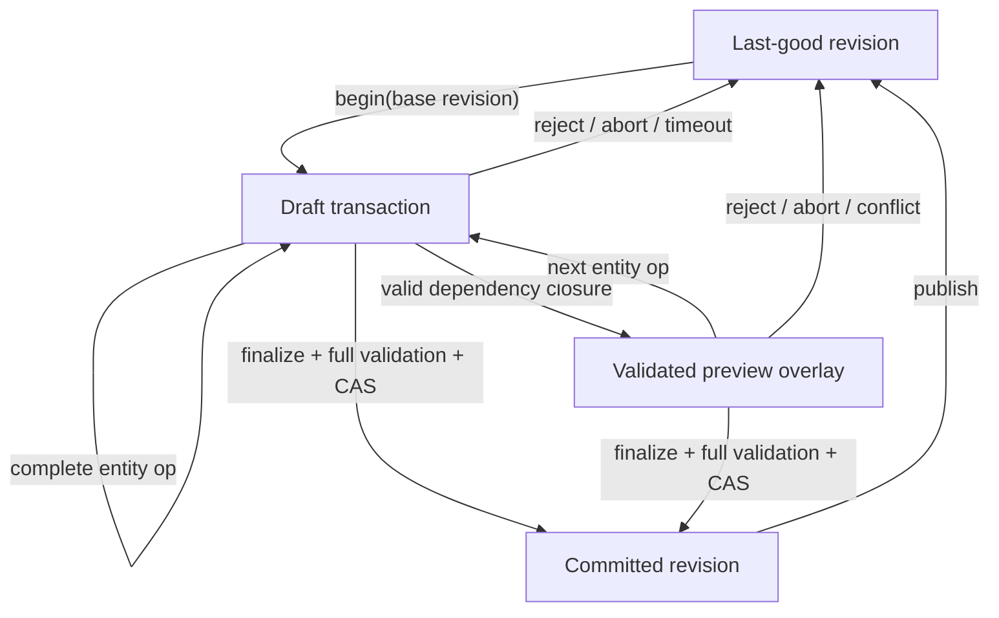
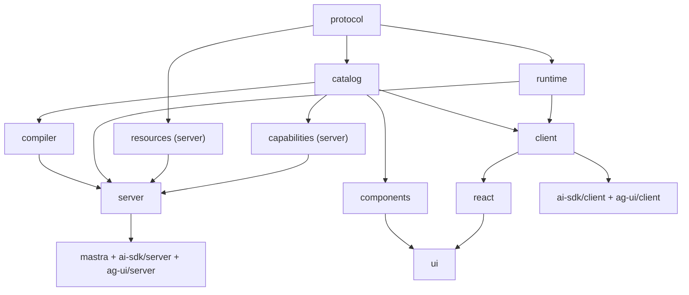

# Tessera Agent Generative UI 终局架构

- 状态：**目标架构决策**
- 日期：2026-08-22
- 当前仓库：Tessera Agent Generative UI 的完整参考实现与验证场
- 范围：最终 Generative UI 底层协议、Compiler、Runtime、Host、Tessera Agent Component Catalog、Renderer 与 Tessera Agent 接入边界
- 后续：验证成功后，另建独立 Open Generative 项目并提炼 framework-neutral core

## 1. 最终决定

本仓库要先证明：**Tessera Agent 可以通过 Host-governed Generative UI 稳定生成真正有用、可交互、可审计的数据分析界面**。模型生成声明式 UI proposal，Host 负责数据、身份、权限、验证、状态、副作用、持久化与最终提交。

这里同时实现完整的 Open Generative 目标架构，但当前仓库不是已经完成拆分的通用 Open Generative 产品：

- 当前唯一产品验收对象是 Tessera Agent；Component、recipe、golden fixture 和 model eval 都必须来自真实数据分析任务。
- 底层仍直接实现最终协议，不能为了验证 Tessera 引入临时 document、tool schema、固定 Query renderer 或第二套链路。
- 本仓库通过完整 reference implementation 验证协议是否正确、生成是否有用、renderer 是否可靠。
- 验证成立后，另建独立 Open Generative 项目；framework-neutral core、React binding 和通用 conformance fixtures 从这里提炼，Tessera 业务 recipes、数据工具与产品集成继续属于 Tessera Agent。
- 本次实现不修改 `/Users/work/data-agent`；真实 Agent/Workbench 接入由 Tessera Agent 的独立实施任务完成。

本文只定义一套最终架构，不定义简化架构或临时协议：

- 底层从一开始就支持完整的 Component Contract、资源绑定、状态、动作、事务流、增量编辑、持久化、回放、迁移、安全与多 framework binding 边界；每个 Surface 仍只协商一个 `RendererRegistry` 并走一条渲染链。
- 当前只减少模型可使用的组件数量，不删减底层能力。
- 新组件只能扩展 Catalog，不能要求更换文档协议、重写 Runtime 或绕过 Host 权限边界。
- 实施可以按依赖顺序推进，但每一步都必须落在最终协议上，禁止临时 JSON、过渡 API 或第二套渲染链路。

文中的 `revision` 只是协议对象的兼容与并发身份，不代表多套产品架构。当前参考实现和未来独立 Open Generative 项目必须共享本文这一套目标模型，未来拆分不能重新发明协议。

核心不变量：

> 模型负责表达与组合；Generative UI Runtime 负责正确性；Tessera Host 负责数据与权力。

### 1.1 当前成功证明

本仓库不是以“package 能 build”作为成功，而以 Tessera Agent 的完整行为证据验收：

1. 同一次 governed Query execution 能发布带 provenance 的 typed pinned Dataset，并由唯一 `data.chart` Contract 根据问题选择 17 个锁定 recipe 中的任意一个，而不是把 Query 结果固定映射成一种视图或把 rows 复制进 Document。
2. 模型只看到安全 descriptor、column metadata、binding/evidence offer；rows 不进入 prompt proposal、Document、chat history 或通用 transport。
3. snapshot 与等价 operation stream 得到完全相同的 canonical content；invalid/abort/conflict 永远保留 last-good。
4. 当前官方 Catalog 只包含 `data.chart`；17 个 recipe 全部走同一 Contract、Resource、stream、Surface 和 renderer 链，并由严格判别联合拒绝非法字段组合。
5. 常见分析任务经过固定 golden set 和 model eval，达到本文完成标准与 [Tessera 成功证明规范](./tessera-data-agent-generative-ui-proof.md)，才允许启动独立 Open Generative 项目。

## 2. 仓库、产品与未来拆分边界

| 名称 | 永久职责 |
| --- | --- |
| **当前仓库** | 完整目标架构的 reference implementation；当前只为 Tessera Agent 设计 Component、renderer、recipes、fixtures 和 evals |
| **Tessera Agent** | 当前 Host 产品与唯一验收对象，提供 Mastra Agent、数据库工具、权限、资源和用户工作台；其 Agent 仓库由独立任务维护 |
| **未来 Open Generative 项目** | 验证成功后单独创建的通用项目，承接 framework-neutral protocol/runtime、bindings、adapters 与通用 conformance |
| **Tessera Data UI Catalog** | 当前第一方 Component Contracts、基于 shadcn/ui 的 React node renderers、chart coverage 和数据分析 recipes |

核心实体必须明确区分：

| 实体 | 含义 |
| --- | --- |
| `Document` | 一份可验证、可持久化的声明式 UI 内容 |
| `Revision` | Document 内容的一次不可变快照，不属于任何 branch |
| `Branch` | Host 持有的可变 revision pointer |
| `Surface` | Document 在某个 Host placement 中的运行实例，持有运行时状态和资源视图 |
| `Proposal` | 模型提交的非可信创建或编辑建议 |
| `Catalog` | 本次生成允许使用的 Component Contract 集合 |
| `Component` | Catalog 中带独立 contract revision 的节点类型 |
| `Node` | Document 内的 Component 实例 |
| `Resource` | Host 管理的数据、文件、证据或媒体对象 |
| `ActionIntent` | UI 发出的 typed intent，不是直接执行的函数或工具调用 |

目标底座是 greenfield 架构，不继承当前仓库的旧公开 document type、协议 namespace 或生命周期命名。现有事务、资源和 capability 代码只作为实现研究与测试资产；某段代码只有在符合本文 Contract 后才可以复用，不能反过来限制新设计。

目标 namespace 锁定为以下值，以保证当前 reference implementation 与未来独立项目不发生协议改名。是否从当前仓库发布 package，必须等 Tessera proof gates 通过后再决定：

```text
protocol:       open-generative.document
stream:         open-generative.stream
packages:       @open-generative/* (target extraction scope; not a proof of publication readiness)
components:     @open-generative/components
```

## 3. 明确不做什么

Open Generative 不生成或执行：

- JSX、JavaScript、HTML、CSS、SQL 或任意代码；
- 任意 npm 组件名、动态 import、脚本、表达式或事件处理函数；
- 模型指定的 URL、CSS style、网络请求、tool name 或 credential；
- 独立应用、route、认证系统、数据库层或 workflow engine；
- 不存在的数据、证据或分析结论。

丰富 UI 来自 **受约束组件的组合、真实资源绑定和 typed intent**，不是来自可执行代码。

## 4. 规范与 Conformance 边界

本文按四个独立 profile 验收，不能用某个集成或 renderer 的通过替代底层通过：

| Profile | 规范范围 | 不得反向约束 |
| --- | --- | --- |
| Core protocol/runtime | Contract、Catalog、authoring、canonical IR、stream、transaction、resource、state、action、persistence 与 framework-neutral runtime | React、shadcn/ui、Tessera Agent 业务模型 |
| React binding | `SurfaceController` 到 `GenerativeSurface`、Renderer Registry、placements 与 Host system surfaces | canonical protocol 的语义和身份 |
| Tessera Data UI components | Tessera Agent Component Contracts、shadcn/ui React renderers、ChartSpec、recipes 与 conformance fixtures | Core 对其他行业 Catalog 的表达方式 |
| Tessera Agent reference integration | Tessera Agent 的 Resource producer、Mastra adapter、Surface stream、history 与 Workbench 接入 | Core、React binding 或其他 Host 产品 |

第 18 节只对 Tessera Agent reference integration 具有规范性；附录 A 只记录调研证据，不定义任何公开 type、wire shape、package boundary 或完成条件。

## 5. 总体架构

```mermaid
flowchart LR
  U["User / Agent turn"] --> TC["Turn Compiler"]
  HC["Host context and grants"] --> TC
  CC["Component Contracts"] --> CS["Task-scoped Catalog Slice"]
  CS --> TC
  TC --> LLM["LLM: present_ui proposal"]
  LLM --> PD["Proposal Decoder"]
  PD --> DT["Draft Transaction"]
  DT --> VA["Validate + Authorize"]
  VA --> RS["Immutable Revision Store"]
  RS --> TS["Trusted Surface Stream"]
  TS --> SC["SurfaceController"]
  SC --> GS["GenerativeSurface"]
  GS --> RR["Renderer Registry"]

  TOOL["Mastra / Host data tools"] --> RG["Resource Gateway"]
  RG --> RB["Scoped Resource Bindings"]
  RB --> TS

  RR --> AI["Typed ActionIntent"]
  AI --> PG["Host Policy Gateway"]
  PG --> CB["Capability Broker"]
  CB --> TOOL
  CB --> RC["Receipt / Resource version / UI revision"]
  RC --> TS
```



系统分成五个长期边界：

| 边界 | 负责 | 不允许负责 |
| --- | --- | --- |
| Contract plane | Component 定义、Catalog、schema、prompt metadata、revision、contractHash、manifestHash、contractSetHash 与 sliceHash | React 渲染、数据读取、effect |
| Authoring plane | turn slicing、provider schema、proposal decode、normalize、repair | 信任模型字段、直接渲染 |
| Document/runtime plane | canonical IR、transaction、revision、state、replay、migration、diagnostics | credential、任意业务调用 |
| Host authority plane | actor/tenant、resource、policy、capability、approval、effect、receipt、audit | 接受模型扩大权限 |
| Renderer plane | placement、可访问渲染、交互投影、局部 error boundary | 直接调用模型指定的 tool/API |

## 6. 唯一 Component Contract

Open Generative 只有一个 framework-neutral、immutable、revisioned `ComponentContract`。Component identity 必须同时防止跨 Catalog 重名、manifest 替换和历史 renderer 漂移：

概念结构：

```ts
type ContractRef = {
  publisher: string
  catalogId: string
  componentType: `${string}.${string}`
  revision: number
  contractHash: string
}

type ComponentContract = {
  ref: ContractRef
  category: "layout" | "content" | "control" | "data" | `extension:${string}`

  resolvedPropsSchema: JSONSchema
  authoringBindings: Record<JsonPointer, BindingPolicy>
  slots: Record<SlotName, {
    accepts: ComponentSelector[]
    min: number
    max: number
    fallback: "omit" | "empty" | "placeholder"
  }>
  events: Record<EventPort, {
    payloadSchema: JSONSchema
    actionContracts: ActionContractRef[]
  }>

  trust: "safe" | "governed"
  commitPolicy: "progressive" | "atomic"
  readiness: ReadinessContract
  placements: PlacementConstraint[]
  accessibility: AccessibilityContract
  assets?: AssetPolicy

  prompt: {
    summary: string
    useWhen: string[]
    avoidWhen: string[]
    examples: ExampleRef[]
  }
  migrations: MigrationRef[]
}

type BindingPolicy = {
  allowedSources: Array<"literal" | "state" | "resource" | "context">
  canonicalExprSchema: JSONSchema
  resolvedValueSchema: JSONSchema
  nullable: boolean
  readiness: "required" | "optional" | "deferred"
  unresolvedFallback: "omit" | "loading" | "empty" | "error"
  state?: { schema: JSONSchema; readableScopes: StateScope[] }
  resource?: {
    kinds: ResourceKind[]
    schemaConstraints: ResourceSchemaConstraint[]
    selector: ResourceSelectorPolicy
    maxSensitivity: Sensitivity
  }
}
```

`resolvedPropsSchema` 只验证 materialize 后的值；每个可绑定 JSON Pointer 还必须有 `BindingPolicy`。它明确 literal/ref 来源、canonical `ValueExpr` shape、state/resource 类型、selector 权限、nullability、readiness 和 fallback。Authoring validator、Canonical ValueExpr validator、resource-aware validator 与 resolved-props validator 都从这两层 schema 联合生成，不能各写一份。

Contract 是唯一来源，并确定性地产生：

```text
provider tool schema
server proposal validator
canonical node validator
client resolved-props validator
TypeScript types
prompt signature and examples
renderer registry requirements
docs and fixtures
capability manifest
contract hash and contract-set hash
conformance and accessibility tests
```

React component 不是 Contract 的一部分。React binding 通过完整 `ContractRef` 注册；Host 只加载本地 allowlist 或验证过 publisher signature 的 manifest，并保留渲染历史 Revision 所需的 contract/renderer lineage。`contractHash`、`manifestHash` 与 `implementationHash` 只能证明内容一致，不能替代 publisher trust。

构建时必须验证：

- active Contract 都有 renderer 或明确的 fallback；
- renderer props 类型来自同一 Contract；
- event port 与 payload validator 完全一致；
- lazy chunk、CSS、icon 和 asset 依赖闭包完整；
- server active `contractSetHash` 与 client Renderer Capability Manifest 中完整 ContractRef 集合计算出的 `contractSetHash` 一致；implementation hash 另行比较。

任何手写 registry 漂移都必须让构建失败。

## 7. Catalog 与 Prompt Compiler

完整安装 Catalog 可以很大，而且一个 Surface 可以组合 Open Generative 官方 components 与 Host 私有扩展。每次模型调用只拿到一个不可变、依赖已锁定的 `CatalogSetSlice`：

```ts
type CatalogManifestRef = {
  publisher: string
  catalogId: string
  catalogRevision: string
  manifestHash: string
  signatureRef?: string
}

type OfferedResourceBindingRef = {
  bindingId: ResourceBindingId
  offerHash: string
}

type OfferedEvidenceRef = {
  evidenceId: EvidenceId
  offerHash: string
}

type ModelVisibleResourceOffer = {
  ref: OfferedResourceBindingRef
  descriptor: ModelSafeResourceDescriptor
  selectorPolicy: ResourceSelectorPolicy
}

type ModelVisibleEvidenceOffer = {
  ref: OfferedEvidenceRef
  descriptor: ModelSafeEvidenceDescriptor
}

type CatalogSetSlice = {
  manifests: CatalogManifestRef[]
  dependencyLockHash: string
  contractSetHash: string
  sliceHash: string
  components: Array<{
    sliceComponentId: SliceComponentId
    contract: ContractRef
  }>
  actions: Array<{
    sliceActionId: SliceActionId
    contract: ActionContractRef
  }>
  resources: ModelVisibleResourceOffer[]
  evidence: ModelVisibleEvidenceOffer[]
  limits: GenerationLimits
  providerSchemaProfile: string
}
```

Slice 由 Host 权限、用户任务、placement、Renderer Capability Manifest、资源类型和跨 Catalog dependency closure 联合决定。相同 component display name 不构成身份，所有 slot selector、dependency 和 renderer lookup 都使用完整 `ContractRef`。模型不自行拼 publisher/catalog/hash；冻结 Slice 为每个 Component Contract 分配短且唯一的 `sliceComponentId`，为每个 Action Contract 分配短且唯一的 `sliceActionId`，authoring proposal 只使用这些短 ID，normalize 时严格映射回完整 ContractRef。Resource 与 Evidence 只能通过同一 Slice 中带 hash 的 Host offer 使用。模型不能请求扩张 Slice。

Prompt Compiler 必须遵守：

- 默认使用一个 `present_ui` 工具，而不是每个组件一个 tool；
- 保留每个 component 的独立严格 schema，不能合并 props bag；
- 顶层 provider 限制由 schema-profile adapter 处理，不能降低 canonical validation；
- 只放入本 turn 有价值的组件、动作、资源与证据摘要；
- prompt、schema、examples 和 contract-set hash 来自同一冻结 Slice；
- Provider 不支持的 schema 特性由 provider lowering profile 编码，但服务器仍按完整 Contract 验证。

## 8. 三层表示，不混为一种 JSON

### 8.1 Model Authoring Proposal

Proposal 面向生成效率，可以是 nested snapshot，也可以是 ordered entity operations。它始终是不可信输入。Snapshot node 可以嵌套；operation 的最小单位必须恰好是一个 entity，不能通过一个 `put-node` 递归夹带其他 node。

创建时，模型使用按 entity kind 分域的 proposal-local ID 支持引用和流式；Host 在 normalize 时分配 canonical entity ID。编辑时，模型只能引用 Host 在 `WriteScope` 中授予的已有 canonical ID。

```ts
type ProposalEntityKind = "node" | "state" | "action" | "resource" | "evidence" | "claim"

type AuthoringEntityRef<K extends ProposalEntityKind> =
  | { kind: K; localId: ProposalLocalId<K> }
  | { kind: K; canonicalId: CanonicalEntityId<K> }

type AuthoringValue =
  | JsonScalar
  | AuthoringValue[]
  | { object: Record<string, AuthoringValue> }
  | { ref: "state"; target: AuthoringEntityRef<"state">; path?: PathSegment[] }
  | { ref: "state-id"; target: AuthoringEntityRef<"state"> }
  | { ref: "resource"; target: AuthoringEntityRef<"resource">; path?: PathSegment[] }
  | { ref: "resource-id"; target: AuthoringEntityRef<"resource"> }
  | { ref: "event"; port: string; path?: PathSegment[] }
  | { ref: "context"; key: "locale" | "timezone" }
  | { condition: SafeCondition }

type AuthoringResourceSelector = {
  projection?: ColumnId[]
  filterState?: AuthoringEntityRef<"state">
  sort?: SortSpec[]
  windowLimit?: number
}

type AuthoringResourceBinding = {
  source: OfferedResourceBindingRef
  selector?: AuthoringResourceSelector
}

type AuthoringEvidenceBinding = {
  source: OfferedEvidenceRef
}

type AuthoringSnapshotNode = {
  localId: ProposalLocalId<"node">
  component: SliceComponentId
  props?: Record<string, AuthoringValue>
  slots?: Record<
    string,
    Array<AuthoringSnapshotNode | AuthoringEntityRef<"node">>
  >
  events?: Record<string, AuthoringEntityRef<"action">>
  evidence?: Array<AuthoringEntityRef<"evidence">>
}

type AuthoringSnapshotEntity<K extends ProposalEntityKind, V> = {
  localId: ProposalLocalId<K>
  value: V
}

type AuthoringSnapshotProposal = {
  kind: "snapshot"
  root: AuthoringSnapshotNode
  stateDefinitions?: Array<AuthoringSnapshotEntity<"state", AuthoringStateDefinition>>
  actions?: Array<AuthoringSnapshotEntity<"action", AuthoringActionDefinition>>
  resourceBindings?: Array<AuthoringSnapshotEntity<"resource", AuthoringResourceBinding>>
  evidenceBindings?: Array<AuthoringSnapshotEntity<"evidence", AuthoringEvidenceBinding>>
  claims?: Array<AuthoringSnapshotEntity<"claim", AuthoringClaimBinding>>
  meta: AuthoringDocumentMeta
}

type AuthoringOperationNodeBody = {
  component: SliceComponentId
  props?: Record<string, AuthoringValue>
  slots?: Record<string, Array<AuthoringEntityRef<"node">>>
  events?: Record<string, AuthoringEntityRef<"action">>
  evidence?: Array<AuthoringEntityRef<"evidence">>
}

type AuthoringCreateTarget<K extends ProposalEntityKind> = {
  kind: K
  localId: ProposalLocalId<K>
}

type AuthoringUpdateTarget<K extends ProposalEntityKind> = {
  kind: K
  canonicalId: CanonicalEntityId<K>
  expectedEntityRevision: EntityRevisionId
}

type AuthoringPutTarget<K extends ProposalEntityKind> =
  | AuthoringCreateTarget<K>
  | AuthoringUpdateTarget<K>

type AuthoringProposalOperation =
  | { op: "put-node"; target: AuthoringPutTarget<"node">; value: AuthoringOperationNodeBody }
  | { op: "remove-node"; target: AuthoringUpdateTarget<"node"> }
  | { op: "put-state"; target: AuthoringPutTarget<"state">; value: AuthoringStateDefinition }
  | { op: "remove-state"; target: AuthoringUpdateTarget<"state"> }
  | { op: "put-action"; target: AuthoringPutTarget<"action">; value: AuthoringActionDefinition }
  | { op: "remove-action"; target: AuthoringUpdateTarget<"action"> }
  | { op: "put-resource-binding"; target: AuthoringPutTarget<"resource">; value: AuthoringResourceBinding }
  | { op: "remove-resource-binding"; target: AuthoringUpdateTarget<"resource"> }
  | { op: "put-evidence"; target: AuthoringPutTarget<"evidence">; value: AuthoringEvidenceBinding }
  | { op: "remove-evidence"; target: AuthoringUpdateTarget<"evidence"> }
  | { op: "put-claim"; target: AuthoringPutTarget<"claim">; value: AuthoringClaimBinding }
  | { op: "remove-claim"; target: AuthoringUpdateTarget<"claim"> }
  | { op: "set-root"; node: AuthoringEntityRef<"node">; expectedRootId?: NodeId }
  | { op: "set-meta"; expectedMetaHash?: string; value: AuthoringDocumentMeta }

type ProposalOperationEnvelope = {
  operationId: string
  sequence: number
  dependsOn: string[]
  payloadHash: string
  operation: AuthoringProposalOperation
}
```

值读取与身份传递是两种不同语义。`state` / `resource` 可以带 `path` 并在 materialize 时读取值；`state-id` / `resource-id` 只能传递 canonical identity，禁止携带 `path`，normalize 后分别成为 `state-id-ref` / `resource-id-ref`。HostIntent 用 identity ref 构造精确的 state/resource precondition，不得为了得到 ID 而读取 state value 或 Resource payload。

`AuthoringResourceBinding` 只是在 Document 中选择或收窄 Host offer，不是创建数据源。Normalize 必须在冻结 Slice 中按 `bindingId + offerHash` 精确查找 offer，并把 selector 与 `selectorPolicy` 求交集；`resourceKey`、version、resolution mode、grant、authority 和 payload 都由 Host 填充。`AuthoringEvidenceBinding` 同样只能绑定 `evidenceId + offerHash`，provenance、content hash 和 source authority 不对模型开放。任何未 offered、过期、hash 不匹配或尝试扩张 selector/provenance 的 resource/evidence operation 都在 normalize 前拒绝。

没有通用表达式语言。条件只支持有界、强类型、无 coercion 的比较与布尔组合；聚合、计算、排序、SQL 和数据转换由 Host resource/tool 层完成。

Snapshot authoring 与 operation authoring 必须覆盖相同实体集合。Snapshot normalize 时先 flatten nested nodes，再走与 operation 相同的 entity validator。Normalize 将 `SliceComponentId -> ContractRef`、proposal-local IDs -> transaction-minted canonical IDs，并生成同构 `CanonicalEntityOperation` union；canonical op envelope 继续携带 operation ID、sequence、dependencies、payload hash 与 expected entity revision。

```ts
type CanonicalEntityOperation =
  | { op: "put-node"; nodeId: NodeId; expectedEntityRevision?: string; value: CanonicalNode }
  | { op: "remove-node"; nodeId: NodeId; expectedEntityRevision: string }
  | { op: "put-state"; stateId: StateId; expectedEntityRevision?: string; value: StateDefinition }
  | { op: "remove-state"; stateId: StateId; expectedEntityRevision: string }
  | { op: "put-action"; actionId: ActionId; expectedEntityRevision?: string; value: ActionDefinition }
  | { op: "remove-action"; actionId: ActionId; expectedEntityRevision: string }
  | { op: "put-resource-binding"; bindingId: ResourceBindingId; expectedEntityRevision?: string; value: ResourceBindingDeclaration }
  | { op: "remove-resource-binding"; bindingId: ResourceBindingId; expectedEntityRevision: string }
  | { op: "put-evidence"; evidenceId: EvidenceId; expectedEntityRevision?: string; value: EvidenceBinding }
  | { op: "remove-evidence"; evidenceId: EvidenceId; expectedEntityRevision: string }
  | { op: "put-claim"; claimId: ClaimId; expectedEntityRevision?: string; value: ClaimBinding }
  | { op: "remove-claim"; claimId: ClaimId; expectedEntityRevision: string }
  | { op: "set-root"; nodeId: NodeId; expectedRootId?: NodeId }
  | { op: "set-meta"; expectedMetaHash?: string; value: SemanticDocumentMeta }
```

每个 `put-*` 都替换一个完整 entity，不是 arbitrary field patch。缺少 `expectedEntityRevision` 只表示 create，目标 ID 必须在 base revision 与当前 Draft 中都不存在；更新已有 entity 必须携带并精确匹配 revision，禁止用省略 precondition 的 `put-*` 覆盖已有 entity。同一 local ID 只能 create 一次；相同 `operationId + payloadHash` 的重放是幂等 retry，其他重复创建一律冲突。`set-root` 和 `set-meta` 在已有值时也必须携带对应 precondition。

Draft 可以暂时包含 forward/dangling references，但 preview 只投影依赖闭包完整的 nodes；finalize 时所有 references 必须闭合。`remove-*` 只有在同一 transaction 内所有 inbound references 同时删除或改写后才能 commit。相同 snapshot 与等价 ordered operations 必须产生完全相同的 `DocumentContent` canonical bytes 和 content hash。

### 8.2 Canonical Document IR

Canonical IR 是 framework-neutral adjacency map。它是 validation、hash、storage、patch、replay、migration 和所有 renderer 的共同真相。

```ts
type DocumentContent = {
  protocol: "open-generative.document"
  protocolRevision: ProtocolRevision
  contracts: {
    manifestRefs: CatalogManifestRef[]
    contractSetHash: string
  }
  requirements: DocumentRequirements
  rootNodeId: NodeId
  nodes: Record<NodeId, CanonicalNode>
  stateDefinitions: Record<StateId, StateDefinition>
  actions: Record<ActionId, ActionDefinition>
  resourceBindings: Record<ResourceBindingId, ResourceBindingDeclaration>
  evidenceBindings: Record<EvidenceId, EvidenceBinding>
  claims: Record<ClaimId, ClaimBinding>
  meta: SemanticDocumentMeta
}

type CanonicalNode = {
  contract: ContractRef
  props: Record<string, ValueExpr>
  slots: Record<string, NodeId[]>
  events: Record<EventPort, ActionId>
  evidence: EvidenceId[]
}

type ValueExpr =
  | { kind: "literal"; value: JsonScalar }
  | { kind: "array"; items: ValueExpr[] }
  | { kind: "object"; entries: Record<string, ValueExpr> }
  | { kind: "state-ref"; stateId: StateId; path?: PathSegment[] }
  | { kind: "state-id-ref"; stateId: StateId }
  | { kind: "resource-ref"; bindingId: ResourceBindingId; path?: PathSegment[] }
  | { kind: "resource-id-ref"; bindingId: ResourceBindingId }
  | { kind: "event-ref"; port: EventPort; path?: PathSegment[] }
  | { kind: "context-ref"; key: "locale" | "timezone" }
  | { kind: "condition"; op: ConditionOperator; args: ValueExpr[] }

type RevisionEnvelope = {
  documentId: DocumentId
  revisionId: RevisionId
  parentRevisionIds: RevisionId[]
  contentHash: string
  hashProfile: HashProfileId
  migrationReceiptIds: string[]
  createdAt: string
  createdBy: ActorAuditRef
}

type CommittedRevision = {
  envelope: RevisionEnvelope
  content: DocumentContent
}
```

`DocumentContent` 是唯一被 content hash 覆盖的对象；`RevisionEnvelope` 绝不参与自己的 hash。`DocumentContent.contracts.contractSetHash` 是 Revision 的唯一持久 Contract-set lock，Envelope 不复制该字段。Hash profile 固定 canonical codec、hash algorithm、Unicode/number normalization 和 domain separator：

```text
contentHash = HASH(
  "open-generative.document-content\0" ||
  canonicalEncode(DocumentContent)
)
```

同一 `hashProfile` 的 canonical bytes 必须跨 server、browser 和语言实现一致。`documentId`、revision/branch identity、actor、时间、当前 grant、expiry、approval、runtime state、resource payload 和 transport metadata 全部排除在 content hash 之外。

`DocumentRequirements` 只能记录文档对数据分类、evidence、placement 或 capability 的最低要求，不能固化当前 Host 权限。Actor、tenant、authority policy revision、grant set、revocation 和 expiry 属于每次 authoring/Surface session 的 `AuthorityContext`，每次 commit、resolve 和 action 都重新求交集。

Revision 中绝不能包含 `branchId`。Branch 是 Host store 中的独立 CAS pointer：

```ts
type BranchHead = {
  documentId: DocumentId
  branchId: BranchId
  revisionId: RevisionId
  headToken: string
}
```

每个 Surface 即使只在本次消息中展示，也使用相同 Document/Revision 模型；区别只是 Host 是否把它持久化到 durable store，不存在另一套 ephemeral 文档协议。

### 8.3 Directional Stream Protocols

四个方向必须使用不同消息联合类型，不能把模型 delta 直接透传给浏览器：

| 协议 | 发送方 -> 接收方 | 内容 |
| --- | --- | --- |
| `ProposalStream` | Model adapter -> Compiler | 非可信 snapshot / entity operation / finish / abort |
| `CommitProtocol` | Compiler -> Runtime store | begin / apply / finalize / abort |
| `SurfaceEventStream` | Trusted server -> Host client | `SnapshotPublished` / `PreviewApplied` / `PreviewInvalidated` / `RevisionCommitted` / `StateChanged` / `ResourceResolved` / `ActionAccepted` / `ApprovalRequested` / `ActionStatus` / `EffectReceipt` / `Rejected` |
| `HostCommandProtocol` | Host client -> Trusted server | `ResumeRequest` / `StateWriteRequest` / `ResourceWindowRequest` / `ActionTriggerRequest` / `ApprovalDecision` / `CancelRequest` / `Ack` |

所有 trusted event 使用统一 envelope：

```ts
type SurfaceEventEnvelope<T> = {
  protocolRevision: ProtocolRevision
  surfaceSessionId: SurfaceSessionId
  streamId: StreamId
  epoch: number
  sequence: number
  eventId: EventId
  cursor: ResumeCursor
  committedRevisionId: RevisionId
  audienceBindingHash: string
  contractSetHash: string
  correlationId: string
  causationId?: string
  payloadHash: string
  payload: T
}
```

Operation 另带 transaction ID、operation ID、sequence、payload hash 和 base revision precondition。Server 声明最大 gap、buffer byte limit、ack watermark 与 backpressure policy；超出 gap、epoch 改变或 cursor 过期时，客户端必须丢弃未确认 overlay，并请求 trusted full snapshot，不能猜测缺失事件。Resume cursor 绑定 actor、tenant、Surface session、stream epoch 和 expiry，只是恢复位置证明，不是 bearer grant；恢复时仍需认证和重新授权。

创建 transaction 的 proposal-local identity 在第一次接受 `localId` 时原子写入 durable transaction-local map：

```ts
type ProposalEntityKey = `${"node" | "state" | "action" | "resource" | "evidence" | "claim"}:${string}`

type CanonicalEntityRef =
  | { kind: "node"; id: NodeId }
  | { kind: "state"; id: StateId }
  | { kind: "action"; id: ActionId }
  | { kind: "resource"; id: ResourceBindingId }
  | { kind: "evidence"; id: EvidenceId }
  | { kind: "claim"; id: ClaimId }

type TransactionIdentityMap = Record<ProposalEntityKey, CanonicalEntityRef>
type TransactionIdentityMapDelta = Partial<Record<ProposalEntityKey, CanonicalEntityRef>>
```

相同 transaction 的 retry/resume/finalize 必须复用该映射；`PreviewApplied` 携带新增 mapping delta。Abort 后这些 canonical IDs 永久 retired，不可在另一个 transaction 复用。Edit 中已有 canonical IDs 与本次新建 local IDs 使用不同字段和 namespace，且 identity map 验证 entity kind 一致，禁止跨 kind 字符串碰撞。

## 9. 真正的流式事务



永久规则：

- 流式最小提交单位是完整 entity operation，不是半个 JSON property。
- Draft 允许 forward refs，但只有依赖闭包完整、Contract 校验通过且 policy 允许的节点才能进入 preview。
- `progressive` 节点可以使用 validated draft projection；`atomic` 数据/结论节点在完整、验证和证据绑定前继续展示 last-good 或 skeleton。
- 同一个 ID 的 completed entity 不能被正在流入的半截 entity 覆盖。
- Preview 不是 Revision，不进入 durable history，也不能触发外部 effect。
- finalize 对整个 graph、resolved contract、resource grants、claims 和 write scope 再做一次验证。
- 任何 parse、validation、repair、timeout 或 CAS conflict 都只丢弃 Draft，不清空 last-good。

Validated preview 是正式、只读的 overlay 协议：

```ts
type ValidatedPreview = {
  surfaceSessionId: SurfaceSessionId
  transactionId: TransactionId
  baseRevisionId: RevisionId
  overlaySequence: number
  previousOverlayHash?: string
  overlayHash: string
  identityMapDelta: TransactionIdentityMapDelta
  operations: CanonicalEntityOperation[]
  renderableNodeIds: NodeId[]
  disabledActionIds: ActionId[]
}
```

`PreviewApplied` 必须声明 previous/new overlay hash，因此 reducer 能检测 replace/gap；`PreviewInvalidated` 在 abort、reject、conflict 或 epoch change 时确定性清除整个 transaction overlay、draft-local state 和 draft resource requests。`RevisionCommitted` 必须在 reducer 的一次原子 transition 中同时 promote 新 base 并 consume 对应 transaction overlay，不发送第二个清理事件，避免重复节点、丢包残留或空帧。

最终渲染投影是：

```text
renderable surface = committed last-good + ordered validated preview overlay
```

Preview node 一律 `interactionMode: "read-only-preview"`，不提供 HostIntent emitter；只有 committed node 可以触发外部 intent。仍来自 last-good 的节点可以继续交互，但 request 必须携带其 committed revision precondition。Transport adapter 必须消费真实 provider delta 或 operation stream，只在完整 entity 到达后产生 Proposal operation，不能等最终 tool output 后伪装成 streaming。

## 10. Resource 是数据边界，不是普通 props

Open Generative 的永久数据流是：

```text
Host resource producer
  -> Resource Gateway 写入真实 payload
  -> Document 只保存 durable ResourceBindingDeclaration
  -> Surface session 获取 actor-scoped ResourceGrant
  -> 模型只看到安全 descriptor/sample
  -> Proposal 绑定 Slice offered bindingId + offerHash
  -> Client 发 ResourceWindowRequest
  -> Server 返回 ResolvedResourceSnapshot + opaque cursor
  -> Renderer 只获得该节点获准的 projection/window
```

持久声明、当前授权和已解析数据必须是三种不同类型：

```ts
type ResourceBindingDeclaration = {
  resourceKey: OpaqueHostResourceKey
  kind: "dataset" | "record" | "document" | "asset" | `custom:${string}`
  schemaConstraint: ResourceSchemaConstraint
  selector: {
    projection?: ColumnId[]
    filterStateRef?: StateId
    sort?: SortSpec[]
    windowLimit?: number
  }
} & (
  | {
      resolution: {
        mode: "pinned"
        versionId: ResourceVersionId
        contentHash: string
      }
    }
  | {
      resolution: {
        mode: "live"
        channelId: string
        freshness: FreshnessPolicy
        schemaCompatibility: "exact" | "backward-compatible"
      }
    }
)

type SurfaceResourceGrant = {
  grantId: ResourceGrantId
  bindingId: ResourceBindingId
  surfaceSessionId: SurfaceSessionId
  actorBindingHash: string
  tenantBindingHash: string
  authorityPolicyRevision: string
  allowedOperations: ResourceOperation[]
  rowPolicyHash: string
  columnPolicyHash: string
  expiresAt: string
  revocationEpoch: number
}

type ResourceWindowRequest = {
  requestId: string
  bindingId: ResourceBindingId
  surfaceSessionId: SurfaceSessionId
  expectedRevisionId: RevisionId
  expectedResourceVersionId?: ResourceVersionId
  serverCursor?: OpaqueServerCursor
}

type ResourceResolutionIdentity = {
  requestId: RequestId
  generation: number
  bindingId: ResourceBindingId
  expectedRevisionId: RevisionId
  expectedResourceVersionId?: ResourceVersionId
  serverCursor?: OpaqueServerCursor
}

type DatasetEnvelope = {
  columns: Array<{
    columnId: string
    label: string
    valueType: "boolean" | "date" | "datetime" | "number" | "string"
  }>
  rows: Array<Record<string, null | boolean | string | number>>
  totalRows?: number
  hasMore: boolean
}

type ResolvedResourceSnapshot = {
  snapshotId: ResourceSnapshotId
  bindingId: ResourceBindingId
  resourceVersionId: ResourceVersionId
  schemaHash: string
  contentHash: string
  observedAt: string
  projectionHash: string
  policyProjectionHash: string
  payload: ResourceWindow
  nextCursor?: OpaqueServerCursor
  evidenceIds: EvidenceId[]
}
```

在持久 Document 内，`ResourceBindingDeclaration` 的 identity 只存在于 `DocumentContent.resourceBindings` 的 map key 和对应 entity operation target，不在 declaration value 中重复。Grant、request 与 resolved snapshot 仍通过 `bindingId` 引用该 identity。Canonical codec、commit、read 与 migration 都把 map key 作为 declaration 的唯一 identity；任何 wire adapter 若同时携带 key/value identity，decode 时必须先验证相等并丢弃冗余字段。

规则：

- 大数据 payload 不进入 Document、prompt、proposal、chat history 或 content hash。
- `resourceKey` 只是持久定位符，不授予任何权限；grant/actor/tenant/expiry/revocation/capabilities 永不进入 Document content hash。
- Resource grant 由 Host 创建并放入本 turn/session；模型只能引用冻结 Slice offered 的 `bindingId + offerHash`，不能伪造 source、tenant 或 policy。
- 每个 Surface snapshot 必须为每个 resource result 保存同 key 的 `ResourceResolutionIdentity`。`ResourceResolved` 只有在 request、generation、binding、Revision、expected version 与 cursor 都匹配当前 pending identity 时才能提交；旧 generation 即使更晚返回也必须丢弃。
- `dataset` 只有一种严格 `DatasetEnvelope`：Chart、Table 与 Resource Gateway 共用相同 columns/rows/totalRows/hasMore schema；row key 必须来自已声明 column，scalar cell 类型、row/window 上限和 `totalRows >= rows.length` 在 Gateway 与 Contract 边界共同验证。
- Component Contract 对允许 `ResourceBindingExpr` 的 prop path、resource kind、resolved schema 与 loading/empty/error fallback 做精确声明。
- 分页、排序、筛选和虚拟化是 Resource capability，不是模型生成的新 SQL。
- Cursor 由服务器创建，并绑定 actor、Surface session、binding、resource snapshot、projection 和 expiry；模型不能生成，Document 不能持久化，客户端不能解析或修改。
- 分析 claims 默认绑定 pinned `ResolvedResourceSnapshot` 和 evidence；实时 dashboard 才可由 Host 显式选择 `live`。Live resolve 每次返回新的 resourceVersionId/contentHash，不能修改已经记录的 snapshot。
- 模型可见 descriptor/sample 仍是不可信数据：必须执行 row/column policy、redaction、provider residency/retention policy 和严格 byte/row/column 上限；Resource 文本按 prompt-injection 输入处理，不能改变 system policy、Catalog 或 grants。
- raw image/download/navigation URL 或 CSS URL 不进入 props。媒体使用 `AssetRef`，强制 MIME/size/integrity、domain/scheme、expiry、download disposition、CSP 和 SVG sanitize policy；普通链接使用 Host-owned `LinkRef` 或 `NavigationIntent`。
- 浏览器缓存不是 authority。Action 触发时服务端按当前 actor、revision、resource snapshot 与 state precondition 重新解析输入。

## 11. State、Action 与 Capability

### State

State definition 属于 Document；state value 属于 Surface runtime snapshot，不进入 Document content hash。

State scope 只有三类：

- `surface`：当前 mount/session 的本地交互状态，只能由 `LocalTransition` 修改；
- `document`：Host 持久化、带独立 state revision/precondition 的状态，只能由 server-authorized `StateWriteRequest` 修改；
- `external`：Host 业务系统拥有，只通过 resource/capability 投影。

模型可以建议 shape 和 initial value，但 scope、persistence、sensitivity、model visibility 与 retention 由 Host policy 决定。Surface-local transition 不得升级为 document/external write；document state write 必须经过 schema、actor、document revision、state revision 和 policy precondition。

### Action

Node 只声明 event port 到 `ActionDefinition` 的绑定。Renderer 只会上报 typed event payload。

```text
Node event
  -> validate event payload
  -> resolve committed state/resource refs on server
  -> validate ActionContract input
  -> authorize actor + tenant + revision + grant
  -> optional approval
  -> idempotent capability execution
  -> receipt
  -> state/resource/document revision event
```

Action 分两类：

1. `LocalTransition`：state set/reset、focus、selection 等无外部副作用操作，在 Runtime 中原子执行。
2. `HostIntent`：一个带固定 revision 的 `ActionContract` 调用，由 Capability Broker 执行。

模型不能编排任意多步业务 workflow。一个用户事件最多提交一个 HostIntent；复杂流程、重试、补偿、幂等和审批属于 Host 的 ActionContract handler。Pending/success/failure/cancel UI 由 Runtime system state 驱动，不由模型临时拼接。

核心类型必须明确：

```ts
type ActionContractRef = {
  publisher: string
  catalogId: string
  actionType: string
  revision: number
  contractHash: string
}

type ActionContract = {
  ref: ActionContractRef
  normalizedInputSchema: JSONSchema
  resultSchema: JSONSchema
  receiptSchema: JSONSchema
  reads: Array<StateOrResourceAccessDeclaration>
  writes: Array<StateResourceOrDocumentWriteDeclaration>
  effectClass: "none" | "read" | "reversible-write" | "irreversible-write"
  risk: "low" | "medium" | "high"
  approvalPolicyRef?: string
  idempotencyScope: IdempotencyScope
  cancellableUntil: CancellableBoundary
  timeoutPolicy: TimeoutPolicy
  retryPolicy: RetryPolicy
  compensationPolicy?: CompensationPolicyRef
}

type ActionDefinition =
  | {
      kind: "local-transition"
      transitions: SurfaceLocalTransition[]
    }
  | {
      kind: "host-intent"
      contract: ActionContractRef
      input: Record<string, ValueExpr>
    }

type ActionTriggerRequest = {
  requestId: string
  idempotencyKey: string
  surfaceSessionId: SurfaceSessionId
  revisionId: RevisionId
  nodeId: NodeId
  eventPort: EventPort
  eventPayload: JsonValue
  statePreconditions: Record<StateId, StateRevisionId>
  resourcePreconditions: Record<ResourceBindingId, ResourceVersionId>
}

type ApprovalRequested = {
  approvalToken: SingleUseApprovalToken
  expiresAt: string
  actorBindingHash: string
  tenantBindingHash: string
  actionContract: ActionContractRef
  revisionId: RevisionId
  normalizedInputHash: string
  effectSummaryHash: string
  statePreconditions: Record<StateId, StateRevisionId>
  resourcePreconditions: Record<ResourceBindingId, ResourceVersionId>
}

type ApprovalDecision = {
  requestId: string
  approvalToken: SingleUseApprovalToken
  decision: "approve" | "reject"
}
```

Action handler implementation、credential 和内部 policy 不进入 Document。Host manifest 按完整 `ActionContractRef` 注册 handler，并验证声明的 read/write/effect 边界；没有匹配且受信的 handler 时，对应 event 不进入 active Catalog。

`ApprovalDecision` 只能消费一次，且 token 绑定 actor、tenant、Surface session、Action Contract revision、规范化 input/effect hash、resource/state preconditions 与 expiry。批准后、effect 执行前，server 必须再次认证、授权并检查所有 precondition；approval 不是永久 grant。

Idempotency identity 至少覆盖 tenant、actor、Action Contract、normalized input hash 与 Host 定义的 operation scope。相同 identity 只能返回原 receipt，不能重执行 effect。Cancel 只在 handler 声明的 cancellable boundary 之前成立；越过不可逆 effect 边界后只能返回当前 status/receipt，不能伪报取消成功。Action、approval、effect 和最终 document/state/resource 事件都共享 correlation/causation IDs。

## 12. Host、Surface 与 Renderer

Open Generative 对 Host 产品只提供一条集成链，但不能把 server authority、browser controller 和 React view 混成一个 package 或一个伪装成全能入口的 React component：

| 模块 | 运行位置 | 职责 |
| --- | --- | --- |
| `HostServer` | server-only | actor/tenant session、Catalog/authority intersection、commit、resource、action、approval、audit |
| `SurfaceController` | browser-safe、framework-neutral | trusted stream reducer、last-good/preview、resume、node-scoped bindings、command transport |
| `GenerativeSurface` | React | 遍历唯一 canonical graph，并通过一个 Renderer Registry 渲染节点 |
| `RendererRegistry` | framework binding | `ContractRef -> node renderer`，不拥有 session、resource authority 或业务 effect |

这四个模块共同提供一个 Host experience，负责：

- placement：inline、panel、drawer、full page；
- verified Document 与 Surface session；
- event resume、last-good、validated preview；
- resource resolve orchestration；
- typed state/action command dispatch；
- pending effect、approval、conflict、error 和 receipt 等 Host-owned system surfaces；
- selection-scoped editing 与 revision history；
- locale、timezone、theme token、density 和 accessibility context。

Renderer 只接收：

```ts
type RendererInput = {
  node: VerifiedCanonicalNode
  contract: VerifiedComponentContract
  projectionMode: "committed" | "read-only-preview"
  resolvedProps: ContractValidatedProps
  slots: RenderedSlots
  stateBindings: NodeScopedStateBindings
  resourceBindings: NodeScopedResourceBindings
  emit?: NodeScopedEventEmitter
  placement: PlacementContext
}
```

Renderer 不能读取整份 Document state 或其他节点的 Resource。`stateBindings`、`resourceBindings` 只包含当前 Contract path 获准并已 materialize 的值；`emit` 只能发送当前 `node.contract` 声明的 event port，并且 preview 模式不提供 emitter。`SurfaceController` 和 server 都要重新验证 revision + node ID + full ContractRef + port + payload + action binding。

交互可用性按 **node + exact event port** 计算，不按“这个节点存在任意 event”计算。Renderer 的 Copy、Export、Apply、Reset 等控件只有在各自端口绑定到已提交 Action 时才启用或出现；无关端口不能误启用控件，preview 即使包含未来 action binding 也始终只读。

渲染规则：

- 未通过 wire、content hash、contract-set hash 和 active manifest 验证的 committed Revision 永不 mount；不能先同步显示再异步验 hash。
- binding evaluation 后必须按 `node.contract` 的完整 `ContractRef` 对 resolved props 做 exact validation。
- 每个节点有独立 error boundary；失败节点使用 Contract fallback，不能清空整个 Surface。
- unsupported component 显示受控 fallback，并保留 diagnostics。
- Host 控制宽度、滚动、主题、密度和系统弹层；模型不能生成任意 className/style/z-index。
- Table 必须支持 virtualized/windowed data；Chart 只接受列 ID、encoding token 和 theme token。
- 所有官方 Contract 包含键盘、screen reader、focus、loading、empty、error 和 reduced-motion 验收项。

React 是第一个官方 binding，不是协议定义。未来 Web Components、native card 或其他 renderer 必须消费同一 Canonical Document 和 conformance fixtures。

当前 Tessera Agent reference React components 统一基于 **shadcn/ui**：使用可复制、可修改的 shadcn source primitives 和 design tokens，不再维护另一套平行视觉基础设施。这一 binding 未来原样抽离到 Open Generative；它不能让 shadcn、Radix 或 Recharts 的 props 泄漏进 canonical protocol。

### 单一 Renderer 原则

Tessera Agent 最终只有一条渲染链：

```text
trusted SurfaceEventStream
-> one SurfaceController
-> one GenerativeSurface
-> one negotiated RendererRegistry
-> Tessera Agent shadcn/ui node renderers
```

当前 registry 只注册 `data.chart`。它内部根据严格 ChartSpec 选择 17 个 Tessera recipe 中的一个，但 recipe 不是 Component，也不产生第二条协议、SurfaceController、Registry 或渲染链。

### Renderer Capability Handshake

可修改的 shadcn source 使 Contract identity 与 renderer implementation identity 必须分开：

```ts
type RendererCapabilityManifest = {
  rendererId: string
  rendererRevision: string
  implementationHash: string
  conformanceRevision: string
  contracts: Array<{
    contract: ContractRef
    placements: PlacementConstraint[]
    features: string[]
    chunkHash: string
    assetHashes: string[]
  }>
}
```

Surface session 建立前，Host 以受信 Catalog manifests 与客户端 Renderer Capability Manifest 求交集，再生成 `CatalogSetSlice`。Session 记录 capability-manifest hash；CanonicalNode 只记录完整 ContractRef，Document content 另外锁定整个 manifest set 与 contract-set hash。Host 修改 shadcn renderer 后必须生成新的 implementation hash 并重跑 conformance，不能冒用旧 renderer identity。

## 13. 持久化、编辑和冲突

Document lifecycle 从一开始就是完整能力：

- immutable revision DAG；
- branch head compare-and-swap；
- create、edit、restore、fork、merge；
- explicit selection/write scope；
- entity-level patch；
- deterministic migration；
- snapshot + op log + state event + resource version + action/effect receipt replay；
- disconnect resume 与 bounded retention。

持久层至少区分四本 append-only ledger：

| Ledger | 记录 | Replay 行为 |
| --- | --- | --- |
| Document | revision envelope、content、entity operations、branch head changes | 重建 immutable revision DAG |
| Surface state | state revision、local/durable transition receipt | 重建获准的 state snapshot |
| Resource | binding、grant audit、resolved snapshot/version/window metadata | 绑定到已保留 snapshot；live source 不可用时明确 unavailable |
| Action/effect | trigger、approval、status、idempotency identity、effect receipt | 只重放 receipt/status，绝不重新执行 effect |

每条记录带 `correlationId`、`causationId`、Surface session、document revision、state/resource version 和 actor audit ref。Retention policy 必须保证一个可恢复 Revision 引用的 pinned resource/evidence snapshot 在声明期限内仍可解析；否则 replay 必须产生确定的 unavailable diagnostic，不能悄悄读取最新 live 数据。

编辑不用重放完整聊天。Host 提供 base revision、选中节点的最小 read bundle 和不可扩张的 `WriteScope`；模型只生成 entity operations。禁止 generic JSON Patch，因为它无法表达 slot、Contract、resource、state 和 action 的原子约束。

冲突时不做 silent last-write-wins。Runtime 返回结构化 conflict，保留双方 revision；Host 决定重新生成、fork 或显式 merge。

## 14. Validation、Repair 与 Observability

验证顺序固定：

```text
bytes/limits
-> codec decode
-> authoring schema
-> normalize and identity mapping
-> graph invariants
-> per-component canonical contract
-> binding legality
-> resource/evidence grants
-> information-flow policy
-> action/write-scope authorization
-> resolved-props contract
-> content hash and commit preconditions
```

Diagnostics 使用稳定 code、phase、entity ID、path、severity、recoverable 和 model-correctable 标记。只有经过 redaction、确实能由模型修正的最小 fragment 才进入 bounded repair；repair 不能看到 credential、敏感资源值或 policy 内部原因。

必须记录并设置 release gates：

- first-pass valid rate；
- repair rate 与 repair success；
- time to first validated node；
- time to commit；
- last-good preservation rate；
- resource payload/token duplication bytes，目标为 0；
- unknown/missing renderer rate；
- action authorization、approval、idempotency 与 receipt completeness；
- replay determinism；
- accessibility matrix；
- provider/model/catalog-profile 的统计样本门槛。

## 15. 未来抽离的包边界

当前 reference implementation 按下列逻辑边界验证最终架构。这里的
`@open-generative/*` 只锁定未来独立 Open Generative 项目的抽离 namespace
和依赖方向，不代表当前存在第二个产品，也不证明这些包已经可以发布；
它不是对旧 package graph 的机械改名清单。

| Package | 职责 |
| --- | --- |
| `@open-generative/protocol` | Browser/server-safe canonical schemas、directional wire types、hash profiles、limits、diagnostics、protocol-revision rules |
| `@open-generative/catalog` | Browser/server-safe `ComponentContract`、verified Contract view、Catalog manifest、schema/prompt/docs/eval 生成物 |
| `@open-generative/compiler` | server-only turn compiler、provider profiles、proposal decode/normalize、repair、commit gate |
| `@open-generative/runtime` | Framework-neutral deterministic graph/value/preview/state/replay/migration reducers，不含 credential 或 React |
| `@open-generative/server` | Server-only `HostServer`、transaction store、Surface session、commit 与 authority orchestration |
| `@open-generative/client` | Browser-safe `SurfaceController`、trusted event reducer、resume、node-scoped command bridge |
| `@open-generative/resources` | Server-only resource schema registry、grant、resolver、projection/window、evidence |
| `@open-generative/capabilities` | Server-only action grants、policy、approval、idempotency、effect receipts |
| `@open-generative/react` | `GenerativeSurface`、React renderer registry、placement 和 Host-owned system surfaces |
| `@open-generative/ai-sdk` | 显式 `./server` 与 `./client` transport exports，不拥有核心语义 |
| `@open-generative/mastra` | Server-only Mastra tool/capability adapter，不拥有核心语义 |
| `@open-generative/ag-ui` | 显式 `./server` 与 `./client` event adapter exports，不拥有核心语义 |
| `@open-generative/components` | Framework-neutral 官方 Component Contracts、ChartSpec、recipes 与 fixtures |
| `@open-generative/ui` | 基于 Open Generative UI primitives 的官方 React node renderers 与 capability manifest |

依赖必须保持无环，browser bundle 不能触达 server-only package：



`@open-generative/client` 只消费 `@open-generative/catalog` 生成的 browser-safe verified Contract view，用于 resolved-props validation；prompt examples、compiler 和签名私钥等 server-only 内容不能进入该 export。`@open-generative/ai-sdk` 与 `@open-generative/ag-ui` 必须使用显式 subpath/conditional exports，构建测试要证明 `./client` 的完整 dependency closure 不包含 `server`、`compiler`、`resources` 或 `capabilities`。

## 16. shadcn/ui Renderer 与完整 Chart 支持

### shadcn/ui 是实现基础，不是模型 DSL

当前 Tessera Agent reference 的所有官方 React node renderer 必须优先组合 shadcn/ui primitives。未来抽离到 Open Generative 后继续采用 shadcn registry/source distribution，使 Host 可以拥有代码、调整主题并审查依赖。

永久规则：

- Open Generative Contract 描述语义、数据和交互，不出现 `className`、Tailwind、Radix prop 或 React component name。
- Tessera Data UI React binding 将 Contract 映射到 shadcn/ui 的 Card、Table、Tabs、Tooltip、Popover、Select、Dialog、Sheet、Skeleton 等 primitives。
- shadcn 缺少领域能力时，可以使用其既有底层库，例如 Chart 使用 Recharts、复杂 Table 使用受控的 table engine，但视觉、token、状态与可访问性仍由 shadcn binding 统一。
- shadcn upstream commit/source exact version、shadcn CLI exact version 与 integrity、Recharts exact version 与 integrity、完整 lockfile hash、official renderer implementation hash 和 contract-set hash 一起进入 build provenance。
- shadcn 上游升级由 renderer conformance suite 吸收，不能改变已有 Document 语义。

### 一个 `data.chart`，覆盖完整 Chart Library

shadcn/ui Chart 本质上是 `ChartContainer`、`ChartTooltip`、`ChartTooltipContent`、`ChartLegend`、`ChartLegendContent` 与 Recharts 的组合，并不是一个封闭 chart wrapper。Open Generative 不能让模型生成 Recharts JSX，也不应为每个官网示例创建一种 Component type。

Tessera Data UI Catalog 只向模型暴露一个带独立 contract revision 的 `data.chart` Component，通过严格 discriminated `ChartSpec` 覆盖 shadcn/ui 当前全部官方 chart family：

| Family | 必须覆盖的能力 |
| --- | --- |
| Area | default、axes、gradient、icons、interactive、legend、linear、stacked、100% stacked、step |
| Bar | default、active、horizontal、interactive、label、custom label、mixed、multiple、negative、stacked |
| Line | default、dots、colored/custom dots、interactive、label、custom label、linear、multiple、step |
| Pie | simple、no separator、donut、active donut、donut text、interactive、label、custom/list label、legend、stacked |
| Radar | default、dots、multiple、radius、legend、icons、custom label、lines-only，以及 circle/fill/custom/none 等完整 grid variants |
| Radial | simple、grid、label、shape、stacked、center text |
| Tooltip/Legend | default、advanced、formatter token、icons、dot/line/dashed/none indicator、custom/none label、legend |

shadcn/ui 的 chart registry 只作为底层 primitive 与实现审计样本，不再直接决定官方 recipe 数量。当前发布基线由本仓库锁定的 17 个 Tessera Data Chart 参考设计、精确 ChartSpec fixture、renderer fixture 与 accessibility fixture 决定；上游 shadcn 新增示例不会自动扩大模型可用 Catalog。

正式实现必须选择唯一 upstream snapshot 和唯一 resolved dependency graph，并生成 machine-readable coverage。不能只锁 major，也不能用 range 代替发布 provenance：

```ts
type ExactPackageLock<Name extends string> = {
  name: Name
  version: ExactSemver
  integrity: PackageIntegrity
}

type ChartCoverageManifest = {
  upstreamRepository: "shadcn-ui/ui"
  upstreamCommit: string
  registryPath: string
  registryTreeHash: string
  shadcnSourceVersion: ExactSemver
  shadcnCli: ExactPackageLock<"shadcn">
  recharts: ExactPackageLock<"recharts">
  rendererLockfileHash: string
  contractSetHash: string
  rendererCapabilityManifestHash: string
  rendererImplementationHash: string
  recipeManifestHash: string
  recipes: Array<{
    recipeName: string
    family: ChartFamily | "tooltip"
    requiredCapabilities: ChartCapabilityToken[]
    chartSpecFixtureId: string
    rendererFixtureId: string
    accessibilityFixtureId: string
  }>
}
```

`ExactSemver` 禁止 range、tag 和隐式 minor/patch 漂移；`PackageIntegrity` 使用包管理器 lockfile 中验证过的完整 integrity。Coverage result 同时绑定 active Contract set、Renderer Capability Manifest 与 implementation hash，不能拿旧 renderer 的通过记录证明新实现。Registry 中每个 recipe 必须恰好映射到一个 valid ChartSpec fixture、renderer fixture 和 accessibility fixture；上游新增、删除、内容 hash 改变或未映射文件都使 `@open-generative/ui` conformance 失败。这个 coverage gate 属于 Open Generative UI React profile，不属于 framework-neutral core protocol gate。

概念 `ChartSpec`：

```ts
type ChartSpec =
  | StepsBarsSpec
  | PipelineStageBarsSpec
  | SleepScoreSpec
  | RevenuePerAccountScatterSpec
  | TrackedTimeSankeySpec
  | VisitorsRadialSpec
  | VisitorsRadarSpec
  | ActivityCalendarSpec
  | RevenueSmoothAreaSpec
  | ActiveUsersHeatmapSpec
  | SignUpFunnelSpec
  | EarnedSoFarBarsSpec
  | ContributionsHeatmapSpec
  | SessionsConversionComboSpec
  | DevicesBarsSpec
  | VisitorsStackedAreaSpec
  | ActivityRingsSpec

type ChartBase = {
  data: ResourceBindingExpr
  title: string
  subtitle?: string
  recipe: ChartRecipe
  equivalentView: "table"
  accessibility: { label: string; description?: string }
}
```

`recipe` 是严格 discriminant。每个分支只暴露该设计所需的列角色、聚合与格式字段：例如 Sankey 只能声明 source/target/value 列，Calendar 与 Heatmap 只能声明日期或二维 bucket/value 列，Combo 只能声明 sessions 与 conversion 列。非法组合在 server proposal validation 时失败，而不是让 renderer 或 Recharts 静默忽略。

模型只能使用：

- Resource 中真实存在的 `ColumnId`；
- recipe 分支明确允许的列角色、聚合与格式 token；
- locale-aware number/date/currency/percent `FormatToken`；
- Contract 声明的 `select`、`legendToggle`、`rangeChange` 等 event port。

模型不能提供：

- formatter/component/function；
- raw Recharts props；
- raw SVG、CSS、gradient definition 或 arbitrary color；
- 任意 icon component；
- 内联大数据数组。

Renderer 负责将 `ChartSpec` 确定性编译成统一视觉系统。Area、Bar、Radar、Scatter 与 Combo 可以使用 Recharts；Sankey、Funnel、Heatmap、Calendar、Devices、Stage Bars 与 Rings 使用 schema 驱动的 SVG/DOM，不能把空 Recharts wrapper 当作实现。所有 recipe 强制稳定尺寸、responsive constraints、空/错误/loading 状态、数据量上限、降采样/窗口化与 prefers-reduced-motion；每个 chart 还必须提供同一 Resource snapshot 的 table 等价视图。

## 17. Tessera Data Chart Catalog

底层完整不等于当前 Catalog 必须暴露大量组件。当前官方 Catalog 只启用一个 Component：

| Component | 核心 props / binding | Slots 与 event ports | Readiness / fallback | React renderer |
| --- | --- | --- | --- | --- |
| `data.chart` | 严格 `ChartSpec`、一个 Dataset ResourceBinding、列角色、聚合和 FormatToken | 无 slots；当前无模型自定义事件 | governed atomic；Host 负责 loading/empty/error/unsupported | shadcn tokens + Recharts 或 schema-driven SVG/DOM |

17 个参考设计是 `spec.recipe` 的判别联合，不是 17 个 Component type：

| Recipe | 主要表达 | 确定性实现 |
| --- | --- | --- |
| `steps-bars` | 步数与目标进度 | DOM horizontal bars |
| `pipeline-stage-bars` | Pipeline stage 横向比较 | SVG/DOM bars |
| `sleep-score` | 单值睡眠评分与分段 | SVG arc + stat layout |
| `revenue-per-account-scatter` | 账户收入分布 | Recharts Scatter |
| `tracked-time-sankey` | 时间来源到去向 | schema-driven SVG Sankey |
| `visitors-radial` | 访客占比环形图 | SVG radial |
| `visitors-radar` | 多维访客比较 | Recharts Radar |
| `activity-calendar` | 日期活动强度 | DOM calendar grid |
| `revenue-smooth-area` | 收入平滑趋势 | Recharts Area |
| `active-users-heatmap` | 二维活跃用户强度 | DOM heatmap |
| `sign-up-funnel` | 注册转化阶段 | schema-driven SVG Funnel |
| `earned-so-far-bars` | 累计收入柱状比较 | Recharts Bar |
| `contributions-heatmap` | 年度贡献强度 | DOM contribution grid |
| `sessions-conversion-combo` | Sessions 与 conversion 双指标 | Recharts Composed |
| `devices-bars` | 设备占比 | DOM proportional bars |
| `visitors-stacked-area` | 多来源访客趋势 | Recharts stacked Area |
| `activity-rings` | 多目标活动完成度 | SVG concentric rings |

所有视觉 token 由 renderer 持有。模型不能提供 rows、raw color、CSS、className、callback、React/Recharts props、HTML 或 SVG markup。标题、统计值和摘要优先由列与 aggregate 从同一绑定 Dataset 推导，不能通过另一条未治理的数据通道注入。

Loading、empty、error、approval、pending effect 与 conflict 不是模型可选 recipe；它们继续由 Contract fallback 和 Host-owned system surfaces 统一渲染。未来增加其他 Component 只扩展 Catalog，不改变 Document、Runtime、Resource、Surface 或 RendererRegistry 架构。

## 18. Tessera Agent 的最终接入链

本节不约束未来 Open Generative core，但对 Tessera Agent reference integration profile 是规范性的。Tessera Agent 现有 SQL policy、RequestContext 与 query execution 可以在安全复审后复用；Mastra tool result schema、Memory serialization、UI stream 和 renderer 必须改为本文定义的 Resource/Document 模型。

```text
User
-> Tessera Agent / Mastra planning
-> governed data tool
-> query tool publishes pinned Query Resource + Evidence
-> tool returns QueryResourcePublicationResult without rows
-> Open Generative turn compiler + frozen CatalogSetSlice
-> model present_ui proposal referencing offered bindingId + offerHash
-> server transaction + validation + commit
-> trusted SurfaceEventStream
-> SurfaceController
-> GenerativeSurface
-> negotiated RendererRegistry + Tessera Data UI renderers
-> typed ActionIntent
-> Tessera Agent capability handler
-> Resource version / state event / Document revision
```

Data query tools 的唯一成功输出形状是引用与安全 descriptor，不是 UI，也不是 payload：

```ts
type QueryResourcePublicationResult = {
  bindingId: ResourceBindingId
  resourceVersionId: ResourceVersionId
  descriptor: ModelSafeResourceDescriptor
  evidenceIds: EvidenceId[]
}
```

这个结果不得包含 rows、opaque `resourceKey`、grant、cursor、actor/tenant hash 或 presentation hints。完整 rows 写入 Resource Gateway；SQL、source tables、duration、queriedAt 和 metric lineage 写入受 policy 控制的 Resource/Evidence ledger。Turn Compiler 可以按 policy 临时读取 bounded descriptor、统计或 sample 供本次模型选择表达方式，但这些值不进入 Document、proposal、chat history 或 Mastra Memory。

现有能力按下面的边界处理：

| 能力 | 最终决定 |
| --- | --- |
| SQL AST/read-only/column policy | 保留 `lib/data-agent/query-policy.ts` 的安全语义，按新 Resource publication 边界复审 |
| DB role、read-only transaction、timeout、abort/cancel | 保留 `lib/data-agent/db.ts` 的执行语义 |
| Access mode 与 server-created RequestContext | 保留 `lib/data-agent/access-mode.ts`，作为 `AuthorityContext` 输入，不能由客户端或模型创建 |
| 每 turn SQL attempt guard | 保留 `lib/data-agent/admin-sql-attempts.ts` |
| Domain SQL 与 metric definitions | 保留业务查询；删除 chart/layout hints 与 Artifact return type |
| Tool result、Memory serialization、UI stream、renderer | 必须替换，不能加兼容层继续传递 rows |

逐文件迁移清单：

| 文件 | 当前职责 | 最终改动 | 处置 |
| --- | --- | --- | --- |
| `src/mastra/tools/data-tools.ts` | 定义 planner/query tools、RequestContext guard，并以包含 rows 的统一 schema 返回查询结果 | 保留 tool IDs、业务 input schemas、admin 检查、SQL attempt guard 与只读 metadata；query tools 调 Resource publisher，只返回 `QueryResourcePublicationResult`。Catalog/schema inspect 继续作为 bounded planner tools | 保留，重写输出边界 |
| `src/mastra/tools/query-artifact-output.ts` | 手写 tool output schema，并从完整结果抽样给模型 | 整体退役；Resource publication validator 和 model descriptor 必须由 Open Generative integration contract 生成，禁止再维护平行 schema | 删除，由 resource-publication adapter 取代 |
| `lib/data-agent/query.ts` | 验证并执行 SQL、序列化 rows、推断 columns/chart、组装固定结果 | 保留 query validation/execution、Postgres value normalization、column inference、truncation、timing 与 provenance；删除 `inferChart` 和 presentation 参数，把 payload + schema + evidence 写入 pinned Resource | 保留执行核心，替换返回契约 |
| `src/mastra/agents/data-analyst.ts` | 配置 Memory/processors、权限 prompt 与 query tools | 保留业务分析和权限指令；通过 `@open-generative/mastra` 加入由冻结 Slice 生成的唯一 `present_ui` tool。只允许 offered `bindingId + offerHash` 和 `sliceComponentId`；Memory 使用 ref-only serializer | 保留并扩展 |
| `app/api/chat/route.ts` | 校验文本与 owner/thread 后，将 Mastra stream 直接桥接为 UI message stream | 保留预算、owner/thread/access-mode 检查；建立 `HostServer`、`AuthorityContext`、Surface session、capability negotiation、CatalogSetSlice 与 Resource grants，经 adapter 输出可信 `SurfaceEventStream`。请求和响应都不得携带 rows | 保留端点，重写主体 |
| `components/data-agent/workbench.tsx` | 扫描 tool part、维护 Artifact/panel state，并固定渲染 Query view | 保留聊天、thread/access-mode 和 placement 外壳；删除 tool-output 扫描与 Artifact state，创建一个稳定 `SurfaceController`，桌面 panel 与移动 placement 都只 mount `GenerativeSurface` 并共用同一 registry | 保留外壳，替换 generated UI 链 |
| `lib/data-agent/query-artifact-adapter.ts` | 兼容转换旧 query result | Greenfield 目标不保留 legacy adapter；所有 Document/Resource/Event 必须由正式 validator 进入 | 删除 |
| `components/artifact-ui/query-artifact.tsx` | 固定 Provider/renderer，并直接读取 rows 生成 CSV | 由 Tessera Data UI node renderers 取代；CSV export 改为 committed node 发出的 typed HostIntent，服务端按 actor/revision/binding/snapshot/grant 重授权 | 删除 |
| `lib/data-agent/history.ts` | 直接 recall 原始 Mastra messages | 写入时即保存安全文本摘要、Document/Revision refs、ResourceBinding/Version refs 与 Evidence refs；Surface 从 revision snapshot/event ledger 恢复，不能从历史 tool result 重建 | 保留模块，重写 serialization |
| `package.json` | 应用直接依赖旧本地组件 packages | 移除旧 scope；server 按直接使用面接入 `@open-generative/server`、`@open-generative/resources`、`@open-generative/capabilities`、`@open-generative/mastra`、`@open-generative/ai-sdk`，browser 接入 `@open-generative/client`、`@open-generative/react`、`@open-generative/ui`。具体依赖升级是独立实施任务 | 迁移依赖边界 |

实现时还必须同步处理下列调用面，不能留下旁路：

| 文件或测试面 | 必须修改的原因 |
| --- | --- |
| `lib/data-agent/types.ts` | 删除固定 `ChartKind`、`DataColumn`、Query result type；保留与 UI 无关的 Catalog 类型 |
| `lib/data-agent/domain.ts` | Domain query 停止传 chart hints 和返回固定 Artifact，统一调用 Resource publication |
| `app/api/history/route.ts` | 不再把原始 Memory tool parts 直接还原给浏览器；返回 ref-only history 与可信 Surface resume/snapshot |
| `lib/data-agent/session.ts` | 当前 Mastra owner 的 `resourceId` 实际是 owner identity，必须重命名或封装为 `ownerId`；它与 Open Generative `ResourceBindingId` 完全无关 |
| `src/mastra/index.ts` | 在 server composition root 注入 Resource Gateway、Host ledgers、adapters 与 payload-safe observability |
| `components/artifact-ui/index.ts`、`components/artifact-ui/types.ts` | 随固定 Artifact renderer 一起删除 |
| `app/layout.tsx`、`app/globals.css` | 移除旧 renderer 样式入口，接入 Tessera Data UI React tokens/source |
| query adapter/tool output tests | 替换为 Resource publication、validator、grant 和 no-payload tests |
| Memory/history tests | 必须断言 rows 不进入 tool result、Memory、history、stream 与 observability |
| query policy/domain tests | 保留 SQL 安全与业务结果测试，适配 publication return |
| eval cases | 增加 `present_ui`、binding 引用、Component recipe、invalid proposal 与 repair evals |
| lockfile | package 边界迁移完成后机械更新；不与当前架构文档任务混做 |

必须删除的旧耦合：

- Data tool 不再决定最终 `chartKind/xKey/yKeys/title/layout`；它只发布真实数据和 evidence，并返回引用、schema descriptor 与安全 metadata。
- 完整 rows 不再进入 tool output、chat stream 或 Memory。
- 不再维护 Tessera Agent type、Mastra Zod schema、component schema 三份固定 Query-result 真相。
- Workbench 不再扫描 tool part 并固定调用旧 Query view；它只 mount `GenerativeSurface`，由 `SurfaceController` 消费可信 Open Generative events。
- table filter/sort/page 不再是不可恢复的组件私有 React state。

## 19. 非规范迁移说明

本节只裁决当前调研资产如何服务后续实现，不定义 Open Generative Contract，也不允许旧实现反向约束第 5 至 17 节。

### 作为设计依据复用

- authoring proposal、normalized graph 与 stream protocol 分层；
- stable IDs、typed refs、conditions、evidence/claims；
- task-scoped Catalog slicing 与 manifest/contract-set/slice hashes；
- begin/apply/finalize/abort、idempotency、replay、last-good；
- server-owned resource/capability authority；
- React-free core 与 adapter separation。

### 在 Open Generative 中重新定义

1. 把 Component Contract 从 `core/compiler/react/events/registry` 多份定义收敛为唯一来源。
2. Semantic data components 声明 typed Resource binding；禁止 rows 内联 proposal。
3. 实现 validated draft projection，不能只记录 `draft-preview` 却永远渲染 last-good。
4. AI SDK/Mastra adapter 桥接真实 entity-op stream。
5. binding resolve 后执行 exact active Component Contract validation。
6. 建立自动 resource resolve orchestration 和 Host system surfaces。
7. Revision 删除 `branchId`，branch pointer 独立存储。
8. 未验证 `contentHash`、`manifestHash` 与 `contractSetHash` 的 direct Document 不得先 mount。
9. Action 收敛成 typed LocalTransition 或单一 HostIntent，复杂 workflow 留给 Host。
10. 将现有 semantic wrapper 提炼成 recipe/eval，而不是 Open Generative 的核心组件模型。

### 唯一可以少做的范围

- Catalog 中当前启用的组件数量；
- 第一方 renderer 的平台数量，React 先实现；
- Tessera Data UI Catalog 之外的行业 Catalog。

这些不会改变协议，也不能成为绕过永久 Contract 的理由。

## 20. 实施依赖顺序

下面只是实现依赖图；所有节点都使用本文最终命名和最终协议：

```text
protocol identity and terminology
-> single Component Contract + generated manifests
-> canonical Document/Revision/Branch specification
-> typed Resource binding and resource gateway
-> transactional validated-preview projection
-> exact resolved-node validation
-> HostServer + SurfaceController + GenerativeSurface + system surfaces
-> ActionIntent/capability end-to-end
-> AI SDK + Mastra streaming adapters
-> small Tessera Data UI Catalog
-> Tessera Agent reference integration through the single Surface path
-> conformance, replay, security, accessibility and model eval gates
```

任何一步都不得引入未来要删除的 public type、wire shape 或 renderer input。

## 21. 完成标准

四个 profile 独立判定；未通过 Core 不能用 React 或 Tessera Agent demo 宣称底层完成，未通过某个 binding/integration 也不应伪报为 Core 缺陷。

### Core protocol/runtime

- 同一 Contract 确定性生成 model schema、authoring/canonical/resolved validators、renderer requirements、docs、fixtures 和 evals，且产物 hash 可复现。
- Snapshot 与等价 operation stream 生成完全相同的 canonical bytes 和 content hash；create/update/remove preconditions 与 transaction retry 具有确定语义。
- 任意 invalid、aborted、timed-out 或 conflicting stream 都保留 last-good；validated preview 可原子 promote 或完整 invalidate。
- Disconnect 后可通过 actor/session-bound cursor 恢复；cursor 过期、epoch 改变和 retention gap 都确定性 fallback 到 trusted snapshot。
- 大资源 payload 不进入 prompt proposal、Document、content hash 或 transport history；grant、cursor、authority 和 runtime state 不污染持久声明。
- 每个 resolved node、event payload、ActionContract input 和 Host command 都经过 active exact Contract validation。
- 每个外部动作都产生 authorization、必要 approval、idempotency、status 与 effect receipt 链，replay 永不重执行 effect。
- 同一 protocol lineage 的历史 Contract revision 可由确定性 migration 读取；unknown/unsupported component 产生安全 fallback 与 diagnostics。
- Server、browser 与至少一个独立 conformance implementation 对 canonical codec/hash、stream reducer 和 replay fixtures 得出一致结果。
- 新增一个非数据 Catalog 不需要修改 canonical protocol、transaction runtime 或 Host authority boundary。

### React binding

- 唯一链路是 `SurfaceEventStream -> SurfaceController -> GenerativeSurface -> negotiated RendererRegistry`，不存在按 Component family 分裂的顶层 renderer。
- Renderer Capability Manifest 在 Surface 建立前完成协商；contract identity 与 implementation identity 分离，未知 chunk/asset/hash 不会 mount。
- Renderer 只获得 node-scoped props/state/resource/event capability；read-only preview 不存在 emitter，committed intent 仍由 server 复验。
- Last-good、loading、empty、error、approval、pending effect、conflict 与 unsupported component 都有确定的 Host-owned surface。
- React binding 通过 keyboard、screen reader、focus、responsive、reduced-motion、loading/empty/error 和 placement matrix。

### Tessera Data UI Components

- 当前唯一 `data.chart` Contract 从同一来源生成 schema、types、registry entry、fixtures、renderer requirements 与 accessibility tests，不存在手写漂移。
- React renderer 基于 shadcn/ui source primitives，但 Tailwind、Radix、React 或 Recharts props 不泄漏到 canonical protocol。
- `data.chart` 对 manifest 锁定的 17 个 recipe 具有一一对应的 valid ChartSpec、真实 renderer、accessibility 与 visual regression fixture。
- Chart manifest 锁定 upstream tree、shadcn source、CLI、Recharts exact versions、package integrity 与 renderer lockfile hash；任何漂移都重新跑 conformance。
- 每个 chart 提供同一 Resource snapshot 的 table 等价视图，并满足尺寸、数据量、降采样和 reduced-motion 限制。

### Tessera Agent reference integration

- 同一次 governed Query execution 可以发布 typed pinned Dataset，并按问题生成不同 `data.chart` recipe；资源保留 evidence/provenance，proposal、Document 和聊天链路不复制 rows。
- Query tool output、Mastra Memory、history API、AI SDK stream 和 observability 均通过 no-payload tests。
- Chat route 建立真实 AuthorityContext、Surface session、CatalogSetSlice、Resource grants 和 transaction，并只发布 trusted Surface events。
- Workbench 只使用一个 `SurfaceController` 和一个 `GenerativeSurface`；桌面/移动只是 placements，不是两套状态或 renderer。
- 固定 Query adapter/view 和旧 package scope 全部退出运行路径；CSV/export 等行为改为 typed HostIntent。
- 现有 SQL policy、read-only DB、access mode、attempt guard 与 domain metric tests 在新 publication boundary 下继续通过。
- Ref-only history 能恢复 message text 与 committed Surface revision；grant 失效或 Resource retention 到期时显示确定的 unavailable 状态。

这套完成标准保证本文架构可以在验证成功后抽离为长期的 Open Generative 底座，而当前唯一产品验收对象和第一个 reference integration profile 始终是 Tessera Agent。

## 附录 A：非规范调研基线

本附录只解释设计来源，不定义 Open Generative Contract。审计基线为：

- `@assistant-ui/react-generative-ui@0.0.15`，repository commit `16bbf6f`；
- OpenUI `lang-core@0.2.15` / `react-lang@0.2.14`，repository commit `c3c0d1b`；
- 当前 Tessera Agent 与当前仓库工作树，2026-08-22。

| 维度 | Tessera Agent 当前 | assistant-ui Generative UI | OpenUI | 当前仓库原型 | 本架构决策 |
| --- | --- | --- | --- | --- | --- |
| 生成单位 | 固定 Query tool output | 一个 `present` JSON tree | 行式 assignment DSL | nested authoring tree | 单一 `present_ui` proposal 通道 |
| Component schema | Query schema 手写多份 | 所有 props 合并为可选大 bag | Library 生成 signature/schema | `NodeContract` 生成 provider schema | 每 Component 独立严格 Contract，按 provider profile 降级但服务端完整校验 |
| Node identity | 每次查询随机 result ID | `$key` 主要是 React key | statement 有 ID，inline node 无稳定 ID | stable node ID | proposal-local ID + Host-minted canonical node ID |
| Streaming | 等 tool output 完成 | partial JSON，可选 `streamProperties` | statement 级、forward ref、增量 merge | 有 transaction/draft 事件 | entity-op 流、forward ref、validated draft projection、last-good |
| Data | rows 内联 tool output/history | props 内联 | Query/Mutation 可由客户端 runtime 调 tool | resource ref 与语义节点边界尚未统一 | typed `ResourceBindingExpr`，payload 永不由模型复制 |
| Validation | 固定 Query schema | Renderer 不逐组件校验 | 有结构化校验但并非完整 schema evaluator | graph 校验强，客户端 exact contract 校验缺失 | proposal、canonical、resolved props、event、intent 全链路校验 |
| Action | 基本只有本地下载 | action registry，payload 任意 | runtime 可直接执行 Query/Mutation | capability broker 与 action plan 原型 | typed ActionIntent -> Host policy -> approval/effect -> receipt |
| Persistence/edit | 消息历史扫描最后结果 | native `present` 无 revision/patch | statement merge，无 durable ledger | revision/transaction/replay 原型 | immutable revision DAG、branch CAS、selection-scoped edit、resume/replay |
| Renderer | 固定 React Query view | React + converters | React runtime | React registry | framework-neutral protocol，React 为第一 binding |

### 借鉴的行为原则

从 assistant-ui 借鉴一个清楚的 `present` 通道、Component Vocabulary 与自动 Schema、React-free IR、Renderer Registry、跨平台 converter，以及服务端 Contract 构建与客户端 Renderer 构建分离。这里特指 native `present` 路径；仓库另有 versioned A2UI surface reducer/adapter，但它不是 `react-generative-ui` 的 canonical protocol，也不能补齐 typed resource、authority 或 durable revision。

从 OpenUI 借鉴 statement-level 流式、forward reference、completed entity 不被半截更新覆盖、局部 merge、last-good、结构化 diagnostics，以及 Component Definition 同时生成 prompt/schema/runtime metadata。OpenUI 的增量单位严格说是 statement；其 last-good 主要来自 completed-statement cache、query previous data 与 component ErrorBoundary 的 last-valid children，不是 durable Surface revision ledger。Open Generative 只借鉴行为原则，不继承其保证范围。

### 明确拒绝的约束

- 不采用 assistant-ui 的 merged prop bag、弱 runtime validation 或任意 action payload。
- 不采用 OpenUI 依赖 Zod key order 的 positional DSL。
- 不允许 Renderer 按模型给出的 tool name 执行 Query/Mutation。
- 不把 statement name、React index 或模型生成的字符串直接当全局稳定身份。
- 不允许组件接收 raw CSS 或 raw remote URL；媒体必须使用 Host 授权的 `AssetRef`。
