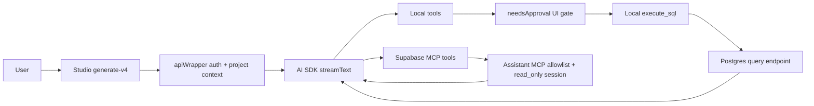
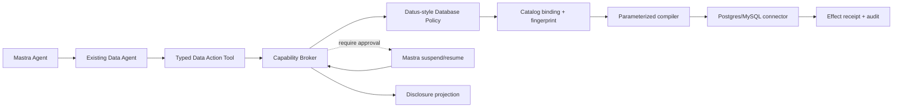

# Supabase Database Agent Analysis

> **Historical, non-normative research input.** This source review is preserved
> as Tessera Agent design evidence. It does not define the current Generative UI
> protocol, component catalog, renderer path, or an Agent/Studio implementation
> plan.

Status: historical source-based review of the pinned `vendor/supabase` submodule

Reviewed commit: `54f56a1baa`

## Executive summary

Supabase does not implement one standalone database agent in the repository. It
implements a product-integrated assistant with two related execution surfaces:

1. Studio Assistant uses the Vercel AI SDK `streamText` loop and a set of local
   and MCP tools.
2. The Supabase MCP server exposes project and database tools to Studio and to
   external MCP clients.

The assistant is good at product context, schema discovery, SQL generation,
RLS guidance, and project operations. It is not a typed database mutation
engine. The model can still author a raw SQL string for the local
`execute_sql` tool. Its execution path is gated by UI approval and then
delegates authorization to the query endpoint/database role. The separate MCP
session adds `read_only=true` and an allowlist, but that MCP setting does not
govern the local Studio `execute_sql` tool.

That is a useful product architecture, but it is a different level of
guarantee from Tessera Agent. Tessera Agent should borrow Supabase's
product-Agent patterns: a bounded tool loop, a static prompt plus per-turn
workspace context, progressive disclosure, opt-in data disclosure,
on-demand knowledge, and evaluation practices. It should keep its own typed
action contract, catalog binding, Datus-style policy, capability broker,
approval binding, and effect ledger. It will not add an MCP transport, MCP
tool loader, or raw-SQL Agent tool.

## Repository map

| Responsibility | Supabase source |
| --- | --- |
| Main assistant request and streaming loop | `vendor/supabase/apps/studio/pages/api/ai/sql/generate-v4.ts` |
| Model loop, prompt assembly, step cap, message sanitization | `vendor/supabase/apps/studio/lib/ai/generate-assistant-response.ts` |
| Local tool registry | `vendor/supabase/apps/studio/lib/ai/tools/index.ts` |
| Local SQL and approval tool | `vendor/supabase/apps/studio/lib/ai/tools/studio-tools.ts` |
| MCP client and read-only assistant session (reviewed as Supabase-specific context, not a target dependency) | `vendor/supabase/apps/studio/lib/ai/supabase-mcp.ts` |
| MCP tool filtering and opt-in categories (reviewed as Supabase-specific context, not a target dependency) | `vendor/supabase/apps/studio/lib/ai/tool-filter.ts` |
| Schema and policy inspection tools | `vendor/supabase/apps/studio/lib/ai/tools/schema-tools.ts` and `fallback-tools.ts` |
| RLS policy generation | `vendor/supabase/apps/studio/pages/api/ai/sql/policy.ts` |
| Self-hosted MCP HTTP route and read-only switch (reviewed as Supabase-specific context, not a target dependency) | `vendor/supabase/apps/studio/routes/api/mcp/index.ts` |
| Studio's MCP-to-scope display/token mapping (reviewed as Supabase-specific context, not a target dependency) | `vendor/supabase/apps/studio/app/api/scoped-access-token-permissions/MCPToolScopeMappings.ts` |
| SQL execution client | `vendor/supabase/apps/studio/data/sql/execute-sql-mutation.ts` |
| SQL fragment branding and formatting helpers, not a SQL parser | `vendor/supabase/packages/pg-meta/src/pg-format/index.ts` |
| Structured SQL helper functions | `vendor/supabase/packages/ai-commands/src/sql/functions.ts` |

## Request and tool flow

`generate-v4.ts` validates the request, authenticates platform traffic,
resolves the organization AI opt-in level, selects an allowed model, obtains
tools, and starts a streaming assistant response. The response loop uses a
maximum of ten AI/tool steps. Dynamic project context is inserted as an
assistant message rather than into the static system prompt, which preserves
provider prompt caching.

The tool registry is assembled in `lib/ai/tools/index.ts`:

- Studio tools are always present.
- Self-hosted deployments use local fallback tools.
- Hosted deployments can fetch MCP tools over HTTP, with an in-process MCP
  fallback behind `USE_REMOTE_MCP`.
- The complete Studio set is filtered through a fixed category map. The
  MCP-sourced subset is additionally checked against a Zod registry schema;
  the local tool set is not passed through that Zod validator.

## How database context reaches the model

Supabase uses progressive disclosure instead of sending every database object
in every turn:

1. `generate-assistant-response.ts` optionally calls `getSchemas`, which uses
   `pg-meta.schemas.list()` and inserts the returned project-wide schema
   inventory as JSON in a request-scoped assistant message. At this commit each
   item has `id`, `name`, `owner`, and `comment`; the surrounding text calls it
   "schema names," but it is not just a list of names.
2. MCP tools such as `list_tables`, `list_extensions`, and `list_edge_functions`
   provide additional project metadata on demand.
3. `list_policies` and the self-hosted fallback tools query existing RLS
   policies and functions when the model needs them.
4. `load_knowledge` injects a curated guide for PostgreSQL, RLS, Storage,
   Edge Functions, or Realtime only when requested by the model.

The client does send its current `schema` and `table` with a chat request, but
the main `generate-v4` handler validates those optional fields and then does
not destructure or forward them. The normal Assistant therefore receives
project-level schema inventory plus on-demand tool output, rather than a
server-bound current-table context. This is neither a catalog fingerprint nor
a semantic binding.

The selected model does cross a server boundary. The client sends its stored
model id; `generate-v4` accepts only known Assistant ids, then falls back when
the caller lacks the advanced-model entitlement or the environment is
throttled. At the reviewed commit the accepted chat models are
`gpt-5.4-nano` and `gpt-5.3-codex`, and this route creates an OpenAI provider
model rather than accepting an arbitrary provider/model pair.

`execute_sql` remains a UI-category tool even when AI opt-in is disabled. The
opt-in setting controls schema/log/data disclosure to the model. Query result
rows reach the model only at `schema_and_log_and_data`; otherwise the tool
returns a fixed no-data message to the model while the UI can still display the
actual result to the user.

The RLS policy endpoint goes further: it uses `generateText` with
`Output.object({ policies: ... })`, instructs the model to inspect existing
policies first, and returns policy proposals. The endpoint does not execute
those proposals itself.

## How database actions are executed

### Reads

The hosted Studio assistant connects to its remote MCP server with
`read_only=true`; the in-process fallback also creates the MCP server with
`readOnly: true`. MCP tool filtering removes write and destructive tools before
they are exposed to the model. This filtering is explicitly the primary
Assistant-side gate; `read_only` is described in the source as defense in
depth. The MCP version of `execute_sql` is stripped so that the separate local
Studio tool owns its approval UI.

Studio contains an OAuth-to-FGA mapping that represents each MCP tool as
OR-of-AND scope groups. It lists `execute_sql` as database-read or
database-write depending on the MCP session mode. This file is a manually
maintained scoped-token/UI mapping derived from the platform controller, not
the hosted controller implementation itself, so it is evidence of the intended
scope contract rather than proof of server-side enforcement.

### Writes

The local `execute_sql` tool accepts a model-authored SQL string, a display
label, chart configuration, and an `isWriteQuery` boolean. It declares
`needsApproval: true`, then passes the SQL to the SQL execution client after
promoting it from an `untrustedSql` display fragment to a `SafeSqlFragment`.
The promotion is a TypeScript/API boundary; it is not a complete semantic
authorization decision.

The `isWriteQuery` field is useful UI metadata but cannot be trusted as a
security classification because the model supplies it. The tool's `execute`
function consumes only `sql`; `isWriteQuery` instead affects the badge/warning
and the connection choice if a user later runs the displayed query locally.
Supabase delegates authorization to the query endpoint/database role after the
approval gate rather than making this model-supplied flag an authority check.

The MCP server can expose broader operations such as migrations, branches, and
project changes to authorized external clients. The Studio assistant's own
allowlist intentionally excludes those write tools.

### Database-native enforcement

For self-hosted MCP execution, `read_only` selects the
`supabase_read_only_user` connection. The same helper defaults its non-read-only
path to `supabase_admin`, so this source does not establish RLS as the
authorization boundary for Studio writes. For hosted execution, Studio sends
the caller's authorization header to the platform query endpoint, whose source
is outside this submodule. Database grants/RLS are effective only to the extent
that the executing role is subject to them. This is stronger than relying on an
LLM prompt, but it is still a coarse boundary compared with a typed
per-relation action policy.

## Permission and privacy model

Supabase has several useful, separate controls:

- `apiWrapper` authenticates the API request.
- Project and organization details determine whether the caller can use the
  assistant and which model is available.
- AI opt-in levels control what may be sent to the model/Bedrock: schema,
  logs, and data are progressively disclosed.
- The Studio scoped-token UI represents MCP OAuth/FGA scope mappings; the
  actual hosted MCP authorization controller is outside this checkout.
- `read_only` selects a database role/mode for MCP sessions.
- Postgres grants and RLS can enforce database access when the selected role is
  subject to them.
- Tool output sanitization removes query rows from future model context when the
  organization has not opted into data sharing.

The important distinction for Tessera Agent is that the AI opt-in setting is a
privacy/disclosure setting, not an actor's database authorization policy. A
user may be allowed to perform a write while not allowing its result rows to
become model context, or may be allowed to inspect a schema without being
allowed to mutate it.

## Human approval and durability

Supabase uses the AI SDK's `needsApproval: true` tool metadata. The client
renders the SQL, calls `addToolApprovalResponse`, and automatically sends the
continuation once all approval responses are complete. Request abort handlers
close MCP connections and cancel active work when the browser closes.

This is a practical interaction gate, but it is not equivalent to a durable
capability broker checkpoint. The reviewed path does not bind approval to a
canonical typed action hash, compiled plan hash, catalog fingerprint, policy
version, or effect receipt. It also does not provide a general idempotent
mutation ledger for retries across process restarts.

Mastra's suspend/resume support is the right runtime primitive for Tessera
Agent, but the authority must remain outside the Agent. The broker should
preflight the action, suspend the run for approval, and revalidate the exact
action and policy before execution.

## Comparison with Tessera Agent

| Concern | Supabase Assistant/MCP | Tessera Agent target |
| --- | --- | --- |
| Agent shape | General assistant with tools and prompts | Existing semantic Data Agent plus Mastra runtime |
| Model database surface | Raw `execute_sql` string plus MCP tools | Existing governed semantic tools and versioned typed actions (`data.read/insert/update/delete/ddl`); no MCP or raw SQL |
| Schema binding | pg-meta summaries and tool calls | Catalog fingerprint and server-side semantic binding |
| Risk classification | UI `isWriteQuery`, MCP read-only mode, approval metadata, DB errors | Server classification, risk floor, profile, scoped rules |
| Authorization | Project auth, scoped-token OAuth/FGA contract, database-role grants/RLS | Actor/tenant/resource/column/row scopes and capability grants |
| Approval | AI SDK UI approval | Durable broker checkpoint bound to action/policy/catalog hashes |
| Mutation execution | SQL endpoint / migration tools | Parameterized compiled mutation plan and connector port |
| Retry semantics | Request and stream lifecycle handling | Idempotency keys, effect state, receipts, recovery |
| Privacy | Organization AI opt-in and output sanitization | Separate disclosure policy and result projection |
| Tool discovery | MCP plus a fixed allowlist and runtime drift warnings | Fixed typed tool registry and server-owned grant set; no MCP transport |
| Evaluation | Studio eval datasets, Braintrust tracing | Existing tests plus broker, policy, compiler, and connector contracts |
| Product integration | Deep Supabase project, RLS, branch, logs integration | Database-neutral connectors with Postgres/MySQL implementations |

Supabase is stronger for a hosted product control plane: it has real project
membership, OAuth/FGA permission groups, MCP interoperability, Postgres/RLS
knowledge, and a mature database operations surface. Tessera Agent is stronger
for a governed, database-neutral mutation protocol: the model does not decide
the SQL authority, approvals are replayable, and policy decisions can be
audited and revalidated.

## Design decisions for Tessera Agent

### Borrow

1. Keep a compile-time typed-tool registry plus a runtime allowlist and drift
   test.
2. Split privacy/disclosure opt-in from authorization and from database policy.
3. Bind current-page context server-side, then disclose the selected semantic
   entity to the Agent through a narrow local tool rather than prompt-supplied
   physical database names.
4. Load schema, RLS guidance, and domain knowledge on demand.
5. Keep a step budget, abort propagation, output sanitization, and trace/eval
   hooks.
6. Represent scope groups as OR-of-AND alternatives when integrating with
   external OAuth/FGA providers.

### Do not borrow as authority or Agent surface

1. Do not expose arbitrary model-authored SQL as the default mutation surface.
2. Do not trust a model-supplied `isWriteQuery` flag for classification.
3. Do not use `read_only=true` as the only application authorization check.
4. Do not treat a browser approval as a durable grant without actor, action,
   policy, catalog, and expiry binding.
5. Do not make Agent prompts responsible for row, column, or tenant isolation.
6. Do not introduce MCP transport or MCP tool loading merely because Supabase
   uses it; the local typed tool registry is the only Agent surface in scope.

### Resulting architecture

The Agent remains conversational. The Data Agent remains semantic. Mastra
transports and suspends the run. The broker and database policy own authority.
Supabase's product integrations become adapters around this boundary rather
than replacing it.

## Source-level risks found in the Supabase implementation

The following are intentional tradeoffs or review points, not claims that the
Supabase product is insecure:

- The example Platform Kit route uses `Boolean(projectRef)` as a placeholder
  permission check and explicitly says that every project is allowed. It is a
  sample and must not be copied to production.
- The Studio `execute_sql` input is raw SQL and its write classification is
  model-supplied metadata.
- The SQL fragment branding protects API boundaries and display handling, but
  is a TypeScript cast at `acceptUntrustedSql`; it does not parse SQL or replace
  parser-backed policy evaluation.
- The hosted assistant keeps its own read-only MCP allowlist, while the broader
  MCP tool contract includes write-capable operations for clients with stronger
  scopes. The hosted controller source is not present in this checkout, so
  source review can verify Studio's client-side distinction but not its remote
  enforcement. Any product integration must preserve that distinction.
- The AI opt-in level intentionally hides data from model context, but it is not
  a database permission grant.
- The main chat request carries `schema` and `table`, but the reviewed handler
  does not propagate either into model context. A Tessera Agent implementation
  should bind its target resource server-side instead of relying on page state.

## Evidence boundary

This submodule contains the Studio client, self-hosted MCP adapter, and the
scoped-token mapping. The hosted MCP controller referenced by comments such as
`mcp.controller.ts` is not included here; Studio depends on the published
`@supabase/mcp-server-supabase` package (`^0.10.0`) and forwards its bearer
token to the remote service. Therefore this review treats token validation and
OAuth/FGA enforcement in the hosted remote MCP service as an external contract,
not as behavior proven from the pinned source tree.
