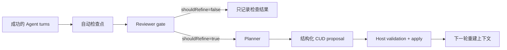

# Tessera Agent Continual Harness

本文说明 Prime Agent 的 continual harness 自进化机制，以及 Tessera Agent 对该机制的受治理适配。

## 1. 结论

Prime Agent 的“自进化”不是训练模型、修改权重，也不是让 Agent 任意改源码。它是一个在线的、可审计的 Harness 改写循环：

1. 收集当前会话轨迹。
2. 在自动检查点先运行 Reviewer，判断轨迹里是否有值得复用的经验。
3. Planner 把经验转换为结构化 `create/update/delete` 补丁。
4. 可信 Host 校验补丁并写入持久化 Harness 状态。
5. 后续请求重新把 Harness 内容装入上下文。
6. 每次写入记录 before/after，可按 revision 回滚。

Tessera 复用了这个控制回路，但没有照搬 Prime Agent 可编辑的 `prompt/memory/skill/subagent` 四类对象。Tessera 第一版只允许演化已经定义好结构和治理边界的领域记忆：

- 用户偏好 `preference`
- 业务术语 `terminology`
- 分析规则 `analysis-rule`
- 数据源偏好 `source-preference`

System Prompt、工具定义、数据库权限、审批策略、SQL 执行边界、凭据和连接配置永远不属于可编辑 Harness。

## 2. Prime Agent 到底怎样自进化

Prime Agent 的核心实现在：

- `packages/coding-agent/src/core/refinement/refinement.ts`
- `packages/coding-agent/src/core/agent-session.ts`
- `packages/coding-agent/src/core/system-prompt.ts`
- `prime-agent-runtime/src/rlm/harness.py`

### 2.1 Harness 状态，而不是模型权重

Prime Agent 保存的是外部状态。每个 Harness entry 包含：

- 稳定 id
- kind：`prompt | memory | skill | subagent`
- title/content/path
- reference/arguments/metadata
- source
- created_at/updated_at
- version

Planner 不能直接改文件。它只能输出 `RefinementProposal`：

```json
{
  "summary": "...",
  "rationale": "...",
  "expectedOutcome": "...",
  "edits": [
    {
      "action": "create|update|delete",
      "kind": "prompt|memory|skill|subagent",
      "id": "...",
      "title": "...",
      "content": "...",
      "reason": "..."
    }
  ]
}
```

可信 TypeScript Host 解析、规范化和应用这些 edits。模型是提案者，不是状态存储的写权限主体。

### 2.2 两段式自动复盘

自动模式不是每到检查点就一定改状态，而是：



Prime Agent 默认检查点为：

- 每 25 个成功 assistant turn
- compaction 完成后
- 自动复盘之间有 20 分钟 cooldown

自动模式经过 Reviewer gate。手动 `/refine` 或运行时的 `refine.run()` 直接进入 Planner，因此手动操作表达的是明确的 Host/用户意图。

### 2.3 local 和 global

Prime Agent 默认写 local session Harness。global 必须明确请求。

- local：当前会话任务、临时约束、当前项目进展
- global：稳定用户偏好、跨会话工具经验、可复用 skill/subagent

Planner 可以同时读取 local 和 global，但一次 refinement 只能写目标 scope。local refinement 中 global entry 是只读的。

### 2.4 Apply 和 rollback

每次 refinement 都记录实际应用结果：

- proposal 的 summary/rationale/expectedOutcome
- 每个 edit 的 before/after
- applied/error
- refinement id
- scope
- 时间

Rollback 不是让模型“再猜一个反向补丁”，而是由 Host 根据已记录的 before/after 构造确定性的反向操作。

### 2.5 Python `harness.py` 的角色

RLM 内核中的 `harness.py` 提供相同状态的读取和 CRUD 能力，让 IPython/RLM 运行时可以使用 Harness entries。它不是训练循环，也不是 Sandbox。TypeScript Host 仍拥有 `/refine` 的规划、验证和持久化主链路。

## 3. Tessera 的适配原则

Prime Agent 是通用 coding/RLM agent，Tessera 是数据库分析 Agent。两者的风险面不同。

如果 Tessera 允许 Planner 修改 prompt、tool 或 permission，历史对话里的一次 prompt injection 就可能变成持久化权限提升。因此 Tessera 使用“固定控制面 + 可编辑领域记忆”的结构：

| 层 | 是否可演化 | 说明 |
| --- | --- | --- |
| Base System Prompt | 否 | 源码定义，部署时变更 |
| Tool definitions | 否 | 只由 Host 注册 |
| SQL execution boundary | 否 | Data Agent 和 connector 治理 |
| Database permissions | 否 | server runtime authorization |
| Approval decisions/policy | 否 | durable database action service |
| Credentials/connections | 否 | server-only config |
| Domain preferences/rules | 是 | 结构化 schema + provenance + scopeRef |

## 4. Tessera 运行流程

实现位于 `apps/studio/src/continual-harness.ts`。

```mermaid
sequenceDiagram
  participant U as User
  participant S as Studio Server
  participant A as Tessera Agent
  participant H as Continual Harness
  participant R as Reviewer
  participant P as Planner
  participant M as Mastra Memory

  U->>S: chat request
  S->>A: StudioAgentRunInput
  A->>H: contextFor(resourceId, threadId)
  H-->>A: approved bounded runtime signal
  A->>A: normal governed agent/tool loop
  A-->>S: UI stream
  S->>S: require visible output + finishReason=stop
  S->>S: persist sanitized UI checkpoint
  S->>H: submitCompletedTurn()
  Note over S,H: fire-and-track; does not delay the response
  H->>H: interval/correction trigger + cooldown
  H->>R: sanitized trajectory + current entries
  R-->>H: shouldRefine
  alt useful lesson
    H->>P: scope=thread + review instructions
    P-->>H: structured create/update/delete proposal
    H->>H: deterministic validation
    H->>H: optimistic revision check + atomic persist
  else no useful lesson
    H->>H: record review only
  end
  opt explicit promotion
    S->>H: promote(entryId, expectedRevision)
    H->>M: synchronize resource working memory
  end
```

### 4.1 什么 turn 可以学习

UI transport 只有同时满足以下条件才提交复盘：

- 没有 suspended tool call
- 请求没有 abort
- `finishReason === "stop"`
- assistant 有可见输出
- browser-safe UI checkpoint 已成功持久化

因此以下情况不会学习：

- 模型输出到一半断开
- Provider error
- 用户取消
- SQL mutation 正在等待审批
- 空回答
- 只有内部 tool/memory 信息、没有用户可见结果

普通 `run()` 和 legacy `stream()` 路径只在返回有效 `StudioAgentRun` 后提交。

### 4.2 自动触发

默认配置与 Prime Agent 对齐：

```ts
studio: {
  continualHarness: {
    enabled: true,
    autoReviewInterval: 25,
    autoReviewCooldownMs: 1_200_000,
  },
}
```

Tessera 额外识别明确 correction/preference signal，例如“记住”“不对”“以后”“默认用”以及对应英文表达。它仍然只触发 Reviewer，不会绕过 Reviewer 直接写入。

Tessera 当前没有 Prime Agent 那样的 conversation compaction 生命周期，所以没有伪造 compaction trigger。

### 4.3 Reviewer

Reviewer 是一个独立、无 tools、无 memory 写权限的 Mastra Agent，使用当前安装版本支持的 structured output：

```ts
await reviewer.generate(input, {
  maxSteps: 1,
  structuredOutput: {
    schema: tesseraHarnessReviewSchema,
    errorStrategy: "strict",
    jsonPromptInjection: "auto",
  },
});
```

Reviewer 只回答：

- `shouldRefine`
- `rationale`
- 可选的 Planner instructions

它会拒绝一次性答案、原始结果、SQL、临时错误、未验证猜测和任何控制面修改请求。

### 4.4 Planner

Planner 也是独立、无 tools 的 Mastra Agent。它只能输出 `tesseraHarnessProposalSchema`：

- `summary`
- `rationale`
- `expectedOutcome`
- 最多 12 个 `create/update/delete` edits

Update/delete 必须引用现有 entry id 和精确 `expectedVersion`。Create 不能自选 id，Host 根据 payload 的语义 identity 生成稳定 hash id，避免模型利用 id 覆盖任意记录。

## 5. 轨迹清洗和证据

Harness 不接收 Mastra 私有 message history，也不接收数据库 connector、SQL request 或原始 tool payload。

`sanitizeHarnessTrajectory()` 只保留：

- 有长度上限、已做 credential/URL/token redaction 的 user text
- assistant 的可见 text
- tool name
- allowlist status/operation/reason
- 少量 count，例如 rowCount/entityCount
- correction signal
- run id 的 16 字符 hash

不会保留：

- SQL
- query rows
- catalog/schema dump
- tool input
- provider metadata
- connector id
- request/approval token
- credential

自动 proposal 的 provenance 还要经过 Host 交叉检查：

- `user-correction` 必须存在明确 correction signal
- `verified-query` 或 `schema` 必须存在 `status=completed` 的 governed tool evidence
- 自动复盘不能声称 `code` 或 `curated` provenance

## 6. Host 侧确定性校验

Zod structured output 只能证明“形状正确”，不能证明“内容安全”。因此 apply 前还有独立内容校验：

1. kind 与 payload discriminant 必须一致。
2. create 不允许 id/expectedVersion。
3. update/delete 必须有 id/expectedVersion。
4. 非 preference 记录必须有窄范围 `scopeRef`。
5. 拒绝 credential/token/password/connection URL。
6. 拒绝 SQL statement。
7. 拒绝 system prompt/tool/permission/approval 修改语义。
8. 拒绝 email 等明显个人数据。
9. 拒绝类似具体 query result 的高密度数字或货币事实。
10. 一个 proposal 的所有 edits 在 clone state 上验证；任一失败则整个 proposal 不写盘。

模型永远不能通过“输出合法 JSON”绕过这些规则。

## 7. Scope 和 promotion

### 7.1 thread-local 默认

所有自动 refinement 强制写 `thread` scope。即使 Planner 认为内容适合全局，它也没有自动扩大影响范围的权限。

Thread owner key 是 `sha256(resourceId + threadId)`。另一个 thread 看不到该 entry。

### 7.2 resource promotion

跨会话生效需要 Host 显式调用：

```ts
const snapshot = await harness.snapshot({ resourceId, threadId });
const local = snapshot.entries.find(entry => entry.scope === "thread");

const result = await harness.promote({
  resourceId,
  threadId,
  entryId: local.id,
  expectedRevision: snapshot.revision,
});
```

Promotion：

1. 检查全局 expectedRevision。
2. 确认 entry 属于该 resource/thread。
3. 复制到 resource scope。
4. 记录 before/after promotion revision。
5. 将 canonical resource entries 同步到 Mastra resource working memory。

这对应 Prime Agent 的“local 默认、global 明确请求”，但 Tessera 使用更符合产品语义的 `thread/resource` 命名。

## 8. Working memory 的所有权

原有 `tesseraWorkingMemoryOptions` 仍使用：

- `enabled: true`
- `scope: "resource"`
- Zod schema
- `useStateSignals: false`

但 `agentManaged` 改为 `false`。主 Data Copilot 可以读取 working memory，却没有 `updateWorkingMemory` 工具，不能绕过 Reviewer/Planner/Host validator 直接修改资源记忆。

Promotion 或 resource rollback 由 Harness 调用 `Memory.updateWorkingMemory()`。同步时：

- 先读取并校验现有 JSON working memory
- 只清理 Harness 自己声明 ownership 的 keys
- 保留其他未归 Harness 管理的合法字段
- 按 canonical resource entries 重新物化
- 再通过 `tesseraWorkingMemorySchema` 做最终校验

Harness revision 会记录 `memorySync`：

- `not-required`
- `pending`
- `completed`
- `failed`

如果 canonical Harness revision 已经原子写入、但 Mastra working-memory 同步失败，API 返回 `status: "partial"`，revision 保留并标记 `memorySync: "failed"`。它不会谎报成全部成功，也不会删除可审计的 canonical 状态。

## 9. 持久化、版本和回滚

状态文件：

```text
<project>/.tessera/continual-harness.json
```

安全属性：

- `.tessera` 为 `0700`
- 状态文件为 `0600`
- 拒绝 symlink/non-regular file
- 同目录独占 lock file 串行化多个 Harness 实例的 read/check/write 事务
- 先写同目录随机 temp file
- 校验后 atomic rename
- resourceId/threadId 只以 SHA-256 owner key 进入 Harness 文件
- 不保存原始会话轨迹

全局 `revision` 是乐观并发版本。Planner 基于 revision N 生成的 proposal，只能在当前状态仍为 N 时应用。每个 entry 还有独立 `version`，update/delete 必须匹配。

单个 Harness 实例内部使用 promise queue 保证顺序执行；多个实例（例如 Settings 热切换期间旧 runtime 尚未完全关闭）则通过 `<state-file>.lock` 的 `open(..., "wx")` 独占锁协调。锁覆盖完整的 read/check/write refinement 事务，因此后进入的实例拿到锁后会重新读取最新 revision，不会用旧内存快照覆盖先完成的写入。等待上限为 60 秒，超过后返回冲突错误；正常完成或抛错都会在 `finally` 中关闭并删除 lock file。

Rollback 过程：

1. 读取目标 revision 的 edits。
2. 逆序检查当前 entry 是否仍等于该 revision 的 after snapshot。
3. 如果后来有人改过该 entry，返回 conflict，不覆盖新状态。
4. 否则恢复 before 或删除当时 create 的 entry。
5. rollback 本身写成一个新的 revision，并记录 `rollbackOf`。

示例：

```ts
const snapshot = await harness.snapshot({ resourceId, threadId });

await harness.rollback({
  resourceId,
  threadId,
  revisionId: snapshot.revisions.at(-1).id,
  expectedRevision: snapshot.revision,
});
```

## 10. 上下文刷新

每个 Tessera Agent turn 开始前都会调用：

```ts
await harness.contextFor({ resourceId, threadId });
```

结果通过 Tessera 已有的 server-owned `runtimeSignals` 注入 transient request context，而不是拼进用户消息或永久改 Base Prompt。

注入内容明确声明：

- 它是 editable guidance
- 不是数据库证据
- 不是 authorization
- 不是 approval
- 使用前必须按当前 catalog 和执行上下文重新验证

同一个语义 id 同时存在 resource 和 thread entry 时，thread entry 优先，形成局部 override。

## 11. Sandbox 是否必需

不必需。Harness 和 Sandbox 解决的是两个不同问题。

### 11.1 Harness 是控制面

Harness 处理：

- 何时复盘
- 学到什么
- 哪些字段可编辑
- 怎样校验和持久化
- 怎样注入下一轮上下文
- 怎样审计和回滚

当前 Tessera Refiner 没有工具，不能执行 Shell、Python、SQL 或网络动作。它只产生结构化对象，因此 Sandbox 不是该控制回路的依赖。

### 11.2 Sandbox 是执行面

Sandbox 处理：

- 不可信代码执行
- 文件系统隔离
- 进程/系统调用限制
- 网络限制
- CPU/内存/时间配额

Prime Agent 使用到 `@anthropic-ai/sandbox-runtime` 的位置是可选 Bash 示例扩展：

```text
packages/coding-agent/examples/extensions/sandbox/index.ts
```

它包装 Bash 执行，不参与 refinement 主链路，也不自动覆盖默认 IPython/RLM kernel 的所有执行能力。因此“Prime Agent repo 依赖了 sandbox package”不等于“自进化必须依赖 sandbox”。

### 11.3 Tessera 什么时候需要 Sandbox

只有未来加入下列能力时，才应新增隔离执行平面：

- 任意 Python/JavaScript code interpreter
- Shell/Bash tool
- 可安装并执行第三方 skill
- 不受信任 MCP server
- Agent 生成代码后自动运行

即使那时加入 Sandbox，Harness Host、权限策略、proposal validator 和 revision ledger 仍应留在可信进程；不能把控制面一起交给被隔离的执行代码。

## 12. 与 Prime Agent 的差异

| 维度 | Prime Agent | Tessera |
| --- | --- | --- |
| 自进化对象 | prompt/memory/skill/subagent | 受治理领域记忆 |
| 自动默认 scope | local session | thread |
| 跨会话 scope | explicit global | explicit resource promotion |
| 自动检查点 | 25 turns + compaction | 25 turns + correction signal |
| cooldown | 20 分钟 | 20 分钟 |
| 自动 Reviewer | 有 | 有 |
| 手动 refinement | `/refine` | thread-only `refineNow()` API |
| 执行工具 | RLM/IPython，可扩展 Bash | Refiner 无 tools |
| Sandbox | 可选 Bash extension | 当前不需要 |
| 权限修改 | Base prompt 不可改 | prompt/tool/permission 全部不可演化 |
| durable global memory | Harness global store | Harness resource + Mastra working memory |

## 13. 测试覆盖

`apps/studio/src/continual-harness.test.ts` 覆盖：

- Reviewer 判断无价值时不调用 Planner
- 明确用户纠正写入 thread-local
- thread 隔离
- 敏感内容和控制面内容拒绝
- 多 edit proposal 原子失败
- 直接 resource proposal 不能绕过 explicit promotion
- 全局 revision conflict
- entry version conflict
- rollback
- explicit promotion
- Mastra resource working-memory 同步
- working-memory 同步失败时返回可审计的 partial revision
- 无 completed evidence 时拒绝 `verified-query`
- 有 governed completed evidence 时接受可复用规则
- 两个 Harness 实例并发共享状态文件时不丢 entry/revision

`apps/studio/src/server.test.ts` 还验证：

- 完整、可见、`stop` 的 UI turn 会提交 Harness
- `finishReason=error` 的半成品不会提交

## 14. 当前边界和后续演进

当前实现刻意不做以下事情：

- 不自动 promotion 到 resource
- 不从原始数据库结果提取长期事实
- 不改 System Prompt
- 不生成/安装 skill
- 不生成 subagent
- 不把错误文本当经验长期保存
- 不暴露浏览器直接写 Harness 的 API

后续若要提供 UI 管理面，建议增加经过认证和 Host authorization 的 endpoints，用于 list/review/promote/rollback；不要让浏览器直接提交任意 proposal。还可以增加离线 eval，把 revision 的 `expectedOutcome` 与后续任务质量关联，在 promotion 前要求重复证据或人工确认。
