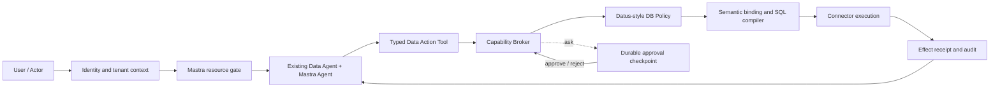
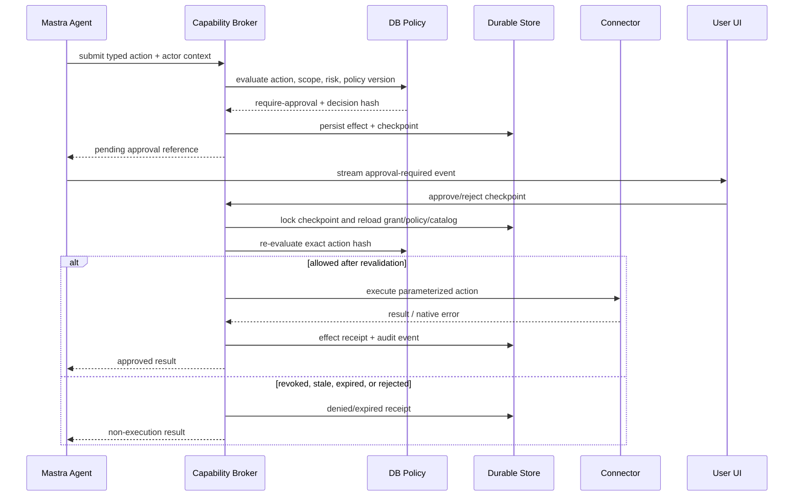

# Tessera Ultimate Agent + Data Permission Architecture

Status: proposed architecture baseline  
Scope: Studio, Data Agent, Mastra runtime, database actions, permissions, approvals, audit  
Decision: preserve the existing Data Agent semantic read path; add write capability behind a server-authoritative action boundary.

## 1. Executive decision

Mastra and Datus are used for different responsibilities:

- **Data Agent** remains the conversational and semantic layer. It understands the user request, produces a typed data intent, binds it against catalog metadata, compiles it, and verifies the result.
- **Mastra** remains the Agent and Workflow runtime. It owns model turns, typed tool calls, context, stream transport, and durable suspension/resume of a run.
- **Capability Broker** becomes the server-side action boundary. It owns grants, approval checkpoints, idempotency, effect state, recovery, output disclosure, and audit references.
- **Datus-style policy** becomes the database policy engine. It classifies database actions, applies `allow / ask / deny`, handles profile and session/project grants, and fails closed for unknown or unsafe input.
- **Database credentials** remain the final enforcement boundary. Application policy must never be treated as a substitute for database-native authorization.

The target execution path is:



The browser is never an authority in this chain. It can display a decision and submit an approval response, but the server revalidates actor, grant, scope, policy version, catalog revision, and action hash before execution.

## 2. Goals and non-goals

### Goals

1. Keep the current read-only Data Agent behavior stable.
2. Add database writes without exposing arbitrary model-authored SQL.
3. Support Datus-compatible `normal`, `auto`, and `dangerous` postures while adding object-level scope.
4. Make `ask` durable across browser refresh, process restart, and worker handoff.
5. Make every effect idempotent, auditable, cancellable where possible, and recoverable.
6. Separate identity/resource authorization from database statement risk.
7. Allow policy changes to revoke or narrow future execution without corrupting existing receipts.

### Non-goals

- Replacing the existing Data Agent with Datus Agent.
- Allowing a browser to submit raw SQL for execution.
- Treating model output, a session flag, or a UI toggle as authorization.
- Using reflection as a security mechanism.
- Making `dangerous` a freely selectable production mode for ordinary users.

## 3. Bounded contexts and ownership

| Context | Owns | Must not own |
| --- | --- | --- |
| Identity | actor, tenant, role, authentication, resource membership | SQL parsing or tool execution |
| Mastra runtime | Agent turn, tool schema, workflow state, suspend/resume transport | final database authorization |
| Data Agent | semantic intent, catalog binding, compiler, result verification | user identity or approval truth |
| Action registry | typed action contracts, handler references, risk metadata | credentials or policy decisions from the browser |
| Capability Broker | grant binding, policy invocation, approval, idempotency, effect state, audit linkage | model reasoning |
| Database policy | profile, category, object scope, SQL/action risk, allow/ask/deny | chat history or UI state |
| Connector | parameterized execution, timeout, transaction, native DB errors | deciding whether an actor is allowed |
| Audit/effect ledger | immutable decisions, receipts, hashes, timestamps | changing an authorization decision retroactively |

The existing files map naturally to this model:

- `/Users/work/tessera-agent/packages/data-agent/src/index.ts`: Data Agent semantic runtime.
- `/Users/work/tessera-agent/apps/studio/src/agent.ts`: Mastra Agent and current read tools.
- `/Users/work/tessera-agent/packages/capability-broker/src/broker.ts`: action authorization and effect boundary.
- `/Users/work/tessera-agent/packages/capability-broker/src/actions.ts`: action state machine and recovery.
- `/Users/work/tessera-agent/packages/database/src/permissions.ts`: initial Datus-style SQL policy evaluator.
- `/Users/work/tessera-agent/apps/studio/src/settings-runtime.ts`: server-only settings and policy persistence.

## 4. Domain model

### 4.1 Actor and resource scope

```ts
type ActorContext = {
  tenantRef: string;
  actorRef: string;
  actorContextRef: string;
  roleRefs: string[];
  resourceScopeRefs: string[];
  allowedSensitivity: ("public" | "private" | "sensitive")[];
};

type DatabaseResourceScope = {
  connectionRef: string;
  databaseRef?: string;
  schemaRefs?: string[];
  relationRefs?: string[];
  columnRefs?: string[];
  rowPredicateRefs?: string[];
};
```

The scope is evaluated before SQL execution. A connection-level grant is not automatically a grant to every schema or table. Row predicates, when supported, are server-generated constraints and cannot be supplied by the model as an authorization bypass.

### 4.2 Typed data actions

The model sees typed capabilities, not SQL:

```ts
type DataAction =
  | { kind: "data.read"; connectionRef: string; query: ReadQuery }
  | { kind: "data.insert"; connectionRef: string; relation: RelationRef; values: JsonObject[] }
  | { kind: "data.update"; connectionRef: string; relation: RelationRef; where: Predicate; patch: JsonObject }
  | { kind: "data.delete"; connectionRef: string; relation: RelationRef; where: Predicate }
  | { kind: "data.ddl"; connectionRef: string; operation: DdlOperation };
```

Every action has:

- a versioned input schema;
- a canonical input hash;
- an explicit connection and relation reference;
- a catalog fingerprint;
- a bounded result schema;
- a declared risk class;
- a handler that performs server-side semantic binding and parameterized compilation.

The initial write release should expose `data.insert`, `data.update`, and `data.delete`. A generic `execute_sql` capability remains disabled by default and should only exist as a separately governed administrative capability, if it is ever needed.

### 4.3 Risk classes

Database operation category and risk are separate dimensions:

| Category | Examples | Default risk |
| --- | --- | --- |
| `read` | SELECT, catalog inspection, aggregate analysis | low/medium |
| `write` | INSERT, bounded UPDATE | medium/high |
| `destructive` | DELETE, DROP, TRUNCATE, ALTER | high/critical |
| `unknown` | unparseable, multi-statement, unsupported operation | critical |

The policy engine may increase risk using affected-row estimates, missing predicates, sensitive columns, cross-schema access, or a stale catalog. It must never reduce an `unknown` operation to `read` merely because the model describes it as safe.

## 5. Policy decision model

The policy decision is deterministic and server-side. Evaluation is fail-closed.

```text
1. Authenticate actor and establish tenant.
2. Resolve capability and verify active grant set/version.
3. Verify connection and object scope.
4. Validate typed input against the action schema.
5. Bind input against the current catalog fingerprint.
6. Classify category and risk.
7. Apply explicit deny rules.
8. Apply profile and scoped rules.
9. Apply session/project grants, never beyond the actor and resource scope.
10. Apply approval requirements and budgets.
11. Return allow, require-approval, or deny with reason codes.
```

Recommended precedence:

```text
tenant/auth failure              -> deny
out-of-scope resource            -> deny
invalid or stale action          -> deny or rebind
explicit deny                    -> deny
unknown/multi-statement          -> require-approval or deny by deployment policy
destructive operation            -> require-approval unless a server-side admin grant says otherwise
explicit valid approval grant    -> allow only for the exact bound action hash
profile/session/project allow    -> allow if no stronger rule requires approval
otherwise                        -> require-approval or deny
```

The Datus-compatible profiles are retained as presets:

- `normal`: reads allowed; ordinary writes ask; destructive and unknown ask.
- `auto`: reads and ordinary writes allowed; destructive and unknown ask.
- `dangerous`: broad allow only when granted by the server for an authorized actor and environment.

`dangerous` is not a client-side setting in a remotely exposed Studio. Production deployments should require an administrator grant, record the grant expiry, and still preserve the database credential boundary.

## 6. Approval lifecycle

`ask` is a durable domain state, not a frontend modal boolean.



Approval must bind at least:

- `tenantRef`, `actorRef`, and approver context;
- `connectionRef` and resource scope;
- capability ID and grant version;
- action input hash and compiled-plan hash;
- policy profile/hash and grant-set version;
- catalog fingerprint and expected database revision/head token;
- Mastra `runId`, `threadId`, and `toolCallId`;
- expiration time and one-time/session/project grant mode.

Approval never means “allow this tool forever” unless a separately authorized grant is explicitly created. A stale policy, changed catalog, changed action input, revoked grant, or expired checkpoint requires a new decision.

## 7. Mastra integration contract

Mastra should transport and resume approval, but the Capability Broker remains authoritative.

The approval decision must be available **before** the write tool executes. A tool that discovers
`require-approval` only after it has already started executing is a protocol error. Use a two-phase
Broker contract:

```text
preflight(typed action, actor)
  -> allow + preflight token
  -> require-approval + checkpoint/preflight token
  -> deny

execute(preflight token, actor)
  -> revalidate token, policy, scope, catalog, and action hash
  -> execute exactly once or return a non-execution result
```

The preflight token is opaque, short-lived, actor-bound, and action-hash-bound. It is not a database
credential and it is not sufficient to skip the second authorization check.

### Tool creation

Each write tool uses Mastra's `requireApproval` as a runtime signal seeded by Broker preflight.
The predicate may classify obvious high-risk calls, but it must not be the only policy check:

```ts
createTool({
  id: "data.update",
  inputSchema: updateActionSchema,
  outputSchema: effectResultSchema,
  requireApproval: async ({ input, requestContext }) =>
    (await broker.preflight(toAction(input, requestContext), actorFromContext(requestContext))).outcome !== "allow",
  execute: async (input, ctx) => broker.execute(ctx.requestContext.preflightToken, actorFromContext(ctx)),
});
```

The approval predicate must not execute the database action. If preflight returns `require-approval`,
Mastra suspends before calling `execute`. The UI calls an HTTP approval endpoint, the server asks the
Broker to approve and revalidate the checkpoint, and then resumes the same durable run. The resumed
tool calls `broker.execute`, which performs the final authorization check and the single effect.

For tools whose approval decision is already known from the action plan, the server may preflight
before exposing the tool to the model. Hiding a denied tool is an optimization, not the final
enforcement boundary.

### Durable runtime requirements

For production approval recovery:

- configure Mastra durable workflow snapshot storage;
- persist `runId`, `threadId`, `toolCallId`, `requestId`, and `checkpointId` together;
- make approval endpoints idempotent;
- do not accept approval decisions from model-authored resume data;
- recover pending checkpoints on startup and reconcile them with Broker state.

Memory storage is still useful for chat history, but it is not a substitute for durable workflow snapshots or effect storage.

## 8. Capability Broker contract

The existing Broker package should be extended by adapters rather than bypassed.

### Required ports

```ts
type UltimateBrokerPorts = CapabilityBrokerPorts & {
  databasePolicy: {
    evaluate(input: DatabasePolicyInput): Promise<DatabasePolicyDecision>;
  };
  actions: {
    preflight(input: TypedDataAction, actor: ActorContext): Promise<PreflightResult>;
    execute(preflightToken: string, actor: ActorContext): Promise<EffectExecutionResult>;
  };
  catalog: {
    getFingerprint(connectionRef: string): Promise<string>;
    bindAction(input: TypedDataAction): Promise<BoundDatabaseAction>;
  };
  workflow: {
    suspend(input: ApprovalTransport): Promise<void>;
    resume(input: ApprovalTransport): Promise<void>;
  };
};
```

### State machines

The action state machine remains the source of truth for effects:

```text
pending
  -> denied
  -> awaiting-approval
  -> approved
  -> running
  -> succeeded | failed | cancelled
```

Transitions must be event-reduced and version-checked. Repeated approval, retry, webhook delivery, or browser submission must return the existing effect state instead of executing twice.

## 9. Storage and audit

The production implementation needs durable stores for:

| Store | Minimum records |
| --- | --- |
| Grant store | capability grants, grant versions, grant-set version, expiry, revocation |
| Policy store | profile, scoped rules, policy hash, actor/role bindings |
| Effect store | request, input hash, status, attempts, idempotency key, receipt |
| Approval store | checkpoint, decision, approver, TTL, policy/catalog fingerprints |
| Workflow store | Mastra suspended run snapshot and transport IDs |
| Catalog store | connection fingerprint, schema revision, binding diagnostics |
| Audit store | append-only decision, approval, execution, output disclosure events |

Audit events should include hashes and references, not credentials or unrestricted result payloads. Sensitive outputs are stored through the existing disclosure/resource binding rules, with content hashes and sensitivity labels.

## 10. API surface

The first production API can remain inside Studio, but the contracts should be package-owned and reusable:

```text
GET  /api/capabilities
GET  /api/approvals?status=pending
POST /api/approvals/:checkpointId/approve
POST /api/approvals/:checkpointId/reject
GET  /api/effects/:requestId
POST /api/effects/:requestId/cancel
GET  /api/audit/effects/:requestId
```

Approval responses must be authenticated and authorized independently from the actor who initiated the action. A deployment may require a separate approver role for destructive actions.

The existing settings endpoint remains a policy configuration surface. It must not directly execute or approve an action.

## 11. Write safety rules

The initial write implementation should enforce the following before execution:

- no raw SQL from model or browser;
- parameterized SQL only;
- `UPDATE` and `DELETE` require a typed predicate;
- configurable maximum affected rows;
- preview/dry-run for medium and high-risk actions;
- transaction boundary for one action invocation;
- statement timeout and cancellation propagation;
- no cross-connection transaction assumptions;
- catalog fingerprint must match the binding used for approval;
- sensitive columns require explicit scope and disclosure policy;
- destructive operations require explicit approval in normal and auto profiles;
- unknown or multi-statement input is denied by default in production.

## 12. Observability and failure handling

Every action should emit structured events:

```text
action.submitted
policy.evaluated
approval.requested
approval.responded
action.started
action.succeeded
action.failed
action.cancelled
action.recovered
output.disclosed
```

Events should carry correlation fields such as `tenantRef`, `actorRef`, `threadId`, `runId`, `requestId`, `invocationId`, `capabilityId`, `decisionId`, `checkpointId`, and `effectReceiptId`.

The user-facing error should be safe and stable. Provider URLs, credentials, raw SQL, and native database details belong in server logs or redacted diagnostics, not in the browser response.

## 13. Migration plan

### Phase 0: architecture freeze

- Keep the current Data Agent read path unchanged.
- Finalize action and policy contracts.
- Add architecture-level invariants and test fixtures.

### Phase 1: connect policy to the existing boundary

- Inject a database policy adapter into the Studio runtime factory.
- Make all database entry points call one server-side evaluator.
- Verify read actions continue to pass under all profiles.

### Phase 2: capability and effect adapters

- Register typed data capabilities in Capability Broker.
- Connect grant versions, actor scope, idempotency, effect receipts, and audit references.
- Add durable storage implementations for the current in-memory/test ports.

### Phase 3: first write actions

- Add `data.insert`, bounded `data.update`, and bounded `data.delete`.
- Compile actions through the existing Data Agent/compiler boundary.
- Add preview, row limits, transactions, and native connector timeouts.
- Keep generic SQL execution disabled.

### Phase 4: durable Mastra approval

- Configure durable workflow snapshots.
- Add approval-required stream events and Studio approval APIs.
- Resume the original run using persisted IDs and revalidate through Broker.

### Phase 5: scoped permissions

- Add actor/role/tenant bindings.
- Add connection, schema, relation, column, and optional row-predicate scope.
- Add separate approver policy for high-risk and destructive actions.

### Phase 6: production hardening

- Add revocation propagation, startup reconciliation, cancellation, rate limits, anomaly detection, and audit export.
- Restrict dangerous posture to short-lived server grants.
- Run failure-injection tests for restart, duplicate approval, stale catalog, revoked policy, connector timeout, and partial execution.

## 14. Acceptance criteria

The architecture is considered implemented only when all of these hold:

1. A model cannot execute raw SQL through any public Agent tool.
2. Every write request produces a canonical action hash and policy decision.
3. A denied action never reaches the connector.
4. An approval survives browser refresh and Studio restart.
5. Duplicate approve/retry requests do not duplicate the database effect.
6. Policy or catalog changes after approval are revalidated before execution.
7. The UI can show why an action is allowed, awaiting approval, denied, expired, or failed without exposing secrets.
8. Database-native credentials still prevent operations that application policy accidentally permits.
9. Existing read-only analysis tests remain green.
10. Audit records can reconstruct who requested, approved, executed, and received each effect.

## 15. Final architectural position

The “ultimate” design is not to make Mastra behave like Datus or to replace the existing Agent with Datus. It is to compose their strongest properties:

```text
Mastra       = conversation and durable workflow runtime
Data Agent   = semantic data intelligence and compiler
Datus policy = pre-execution database risk and permission gate
Broker       = authoritative action, approval, idempotency, and audit boundary
Database     = final credential and transaction boundary
```

This preserves the current Agent strategy while giving the system a real permission model, durable approvals, and controlled CRUD/DDL capability when those actions are deliberately introduced.
